# LangGraph 的精髓，不是循环，而是运行时

## 引子：为什么不能只把 LangGraph 理解成循环

很多人第一次接触 LangGraph，会把它理解成“一个支持循环的 LangChain Graph”。

这个理解不算错，但只停在第一层。

LangGraph 的真正价值，不是多给开发者一种画图方式，而是把 agent 从“一个循环调用 LLM 的函数”，提升成一个可恢复、可观察、可并发、可组合的状态机运行时。

这篇文章不做 API 手册，而是从设计角度拆一下：为什么 LangGraph 会长成现在这样。重点不是罗列接口，而是看它如何把状态、控制流、并发、恢复和观察能力收进同一个运行时抽象里。其中，Pregel/BSP 是这套运行时最关键的执行骨架。

## 1. 全局视角：LangGraph 到底在运行什么

先放一张全局图。理解 LangGraph，最好不要从 `create_react_agent` 或某个模板入口开始，而是从一个更底层的问题开始：一个状态化运行时，到底如何接管 agent 的生命周期？


> 图 1：LangGraph 全局架构。

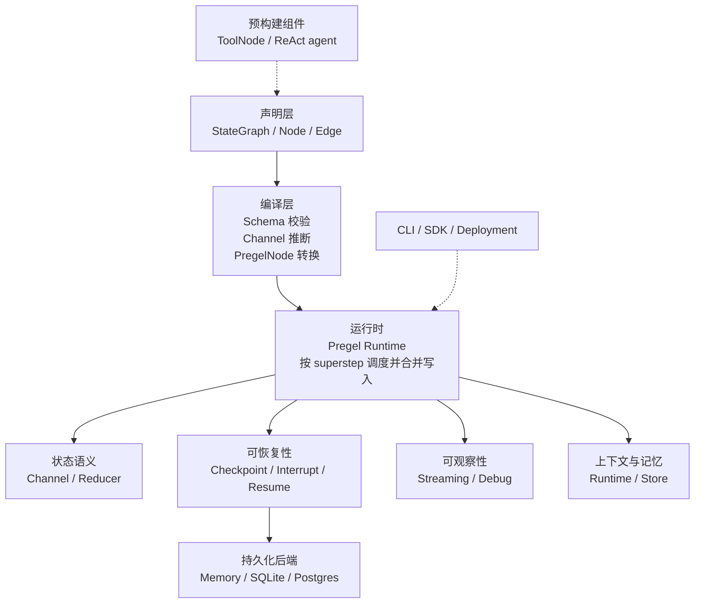

在这个层次上，有 3 个点需要注意。

第一，`StateGraph` 不是最终运行时。它是一个 builder，负责声明状态 schema、节点、边和条件分支。`compile()` 之后得到的 `CompiledStateGraph` 继承 Pregel 运行时，才真正拥有 `invoke()`、`stream()`、`ainvoke()`、`astream()` 等执行能力。

第二，LangGraph 的核心不是“帮你写 prompt”，而是“接管状态变化”。节点只返回 partial update；状态如何合并、什么时候调度下一批节点、什么时候 checkpoint、如何 stream，都由 runtime 统一处理。

第三，checkpoint、stream、interrupt、retry、cache、store 不是散落在 agent loop 外面的补丁。它们都围绕同一个执行循环工作。这是 LangGraph 和手写 `while True` agent 的根本差异。

如果从仓库分层看，会更清楚：

| 层次 | 主要目录 | 解决的问题 |
|---|---|---|
| 核心运行时 | `libs/langgraph` | `StateGraph`、Pregel、channel、streaming、interrupt、runtime 注入 |
| 持久化协议 | `libs/checkpoint` | checkpoint、store、cache、serde 的基础接口和内存实现 |
| 持久化实现 | `libs/checkpoint-sqlite`, `libs/checkpoint-postgres` | SQLite / Postgres checkpointer 和 store |
| 高层组件 | `libs/prebuilt` | `ToolNode`、ReAct 风格 agent 等常见模式 |
| 工程化入口 | `libs/cli`, `libs/sdk-py` | 本地开发、部署配置、Server API 调用 |

所以一句话概括：

```text
LangGraph = 显式状态 schema
          + channel/reducer 合并语义
          + Pregel superstep 调度
          + checkpoint 恢复协议
          + streaming / interrupt / store 等运行时能力
```

后面所有细节都围绕这条主线展开。

## 2. Agent 的问题不是“会不会循环”

手写一个 agent loop 并不难：

```python
while True:
    decision = llm.invoke(state)

    if decision.type == "final":
        return decision.answer

    observation = call_tool(decision.tool, decision.args)
    state["messages"].append(observation)
```

难的是这个 loop 一旦进入生产，就不再只是“LLM 调工具，工具再回 LLM”。

它会变成长流程：一次运行里有多轮模型调用、工具调用、校验、重试和人工确认。它也会变成强状态：每一步都依赖历史消息、工具结果、计划、中间产物和用户上下文。更麻烦的是路径不确定：LLM 可能临时选择工具、生成参数、进入分支，甚至在人工介入后从中间继续。

所以问题不在循环语法，而在运行时语义：

```text
并发节点怎么读写同一份状态？
多个节点同时写一个字段，结果怎么算？
中途失败后，从哪里恢复？
人工审批等待几小时，进程是否必须一直挂着？
如何看到每一步到底发生了什么？
```

LangGraph 的回答不是把 agent 包装得更神秘，而是把它拆成一个可调度、可恢复、可观察的状态机。循环只是表象，状态生命周期才是核心。

> 图 2：从手写循环到生产运行时，缺的不是 `while`，而是状态和生命周期管理。

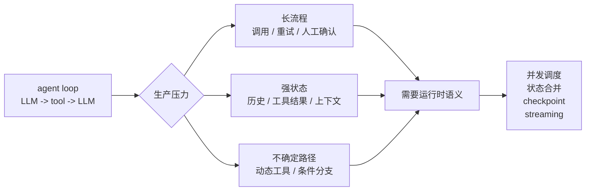

## 3. 两个核心设计：BSP 边界 + Reducer 语义

如果只挑 LangGraph 最值得学习的两个设计，我会选 BSP 和 reducer。前者定义执行边界，后者定义状态合并语义。

BSP 是 Bulk Synchronous Parallel 的缩写，可以把它理解成一种“分轮执行 + 栅栏同步”的并行计算模型。它不要求所有事情串行发生，而是把一次运行切成一轮一轮的 superstep：

```text
Plan:
  根据上一轮稳定状态，决定本轮哪些节点要运行。

Execute:
  并发执行这些节点。节点读取同一个稳定快照，只产出 writes。

Update:
  等本轮节点都结束后，跨过 barrier，把 writes 统一合并成下一轮稳定状态。
```

这就是 BSP 在 LangGraph 里的核心作用：定义“什么时候可见”。同一个 superstep 里的节点都读取上一个稳定快照；本轮写入不会立刻被其他同轮节点看见，必须等 barrier 之后统一合并，下一轮节点才能读到。

这个边界很重要。否则，两个并发工具节点可能一边读旧消息，一边写新消息；某个节点是否能看到另一个节点刚写入的字段，也会取决于线程调度顺序。BSP 把这种不确定性压回到清晰的轮次边界里：

```text
同一轮：
  只读上一个稳定快照，互相看不到本轮 writes。

跨过 barrier：
  runtime 统一合并 writes，生成新的稳定快照。

下一轮：
  节点读取合并后的新状态。
```

如果说 BSP 解决的是“什么时候可见”，reducer 解决的就是“怎么合并”。

每个 state key 背后都有 channel。多个节点同时写同一个字段时，是追加、按消息 ID 合并、累加，还是直接报错，都由这个字段自己的 channel/reducer 决定。

这个设计的重点不是“LangGraph 帮你 merge dict”，而是把合并策略从 node 里抽离出来。如果没有 reducer，用户很容易把消息处理代码写进每个节点：先读 `state["messages"]`，再 append、去重、按 message ID 覆盖、匹配 `tool_call_id`，最后把整段 messages 写回去。

这样看起来直接，但会带来几个问题：

```text
业务逻辑和状态合并混在一起，node 越写越重。
不同 node 可能各自实现一套消息合并，语义不一致。
并发节点都读到旧 state 再写回整段字段，容易互相覆盖。
runtime 只能看到最终写回的整段字段，看不到每个节点的真实增量。
```

Reducer 把这件事变成字段级协议：node 只负责产出“我新增了什么 / 我更新了什么”，channel 负责判断这些更新如何进入全局状态。这样业务计算、并发控制和恢复语义才不会缠在一起。

这两个设计刚好互补，也分别约束了运行时最容易失控的两个问题：

```text
BSP 管可见性：
  本轮写入下一轮才可见。

Reducer 管冲突：
  同一字段多写必须有明确合并语义。

Runtime 管执行边界：
  节点只产出局部 writes，统一由运行时调度、合并、checkpoint 和 stream。
```

它们合在一起，才让 agent 图在循环、并发、失败恢复时仍然可解释。

> 图 3：BSP 和 reducer 分别控制“可见性边界”和“状态合并语义”。

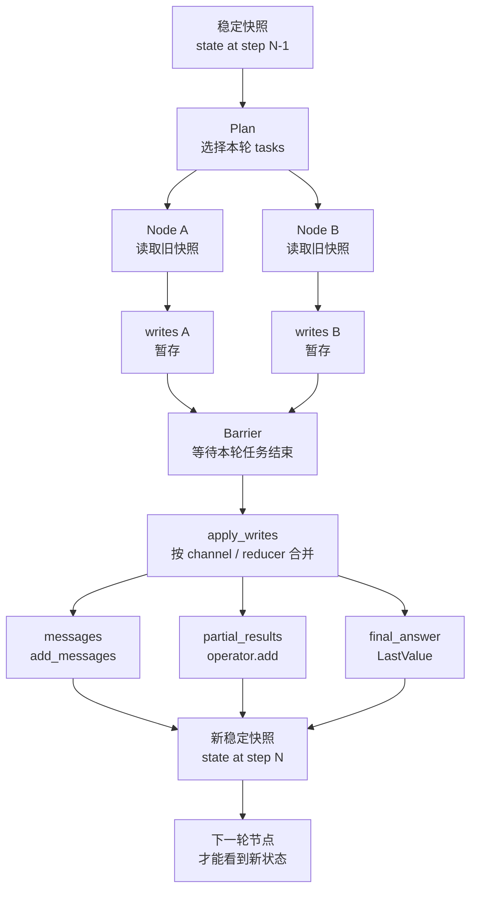

这里最容易忽略的是 `LastValue`。默认 `LastValue` 并不是“谁最后写谁赢”。如果同一个 superstep 里多个节点同时写同一个 `LastValue` channel，LangGraph 会抛 `InvalidUpdateError`。

这是一种有意为之的严格性：并发冲突应该暴露出来，而不是被线程调度顺序悄悄吞掉。

所以一个典型 agent state 通常会显式声明不同字段的合并方式：

```python
from typing_extensions import TypedDict, Annotated
import operator
from langgraph.graph.message import add_messages


class AgentState(TypedDict):
    messages: Annotated[list, add_messages]
    partial_results: Annotated[list[str], operator.add]
    final_answer: str
```

含义是：

```text
messages:
  用 add_messages 合并，适合 chat history，按消息 ID 合并和覆盖

partial_results:
  用 operator.add 追加，适合 map-reduce 的并行结果

final_answer:
  默认 LastValue，适合单一最终答案；同一 superstep 多写会报错
```

这也是 LangGraph 和普通 dict merge 最大的区别之一：字段的数据类型说明它长什么样，字段的 reducer 说明它在并发和恢复场景下应该怎么更新。

## 4. StateGraph：把 Agent 拆成状态机

LangGraph 最常用的入口是 `StateGraph`。它要求你先定义状态，再定义节点，最后定义边。

```python
from typing_extensions import TypedDict, Annotated
import operator
from langgraph.graph import StateGraph, START, END


class State(TypedDict):
    input: str
    steps: Annotated[list[str], operator.add]
    answer: str


def plan(state: State) -> dict:
    return {"steps": ["plan"]}


def respond(state: State) -> dict:
    return {"answer": f"done: {state['input']}"}


builder = StateGraph(State)
builder.add_node("plan", plan)
builder.add_node("respond", respond)

builder.add_edge(START, "plan")
builder.add_edge("plan", "respond")
builder.add_edge("respond", END)

graph = builder.compile()
```

这个例子里真正重要的不是 API 形式，而是语义边界。节点不直接修改全局状态，而是返回一个 partial update：

```python
def plan(state: State) -> dict:
    return {"steps": ["plan"]}
```

也就是说，节点的职责是计算“我要写什么”。真正把 update 合并回全局状态、决定下一步跑哪个节点、什么时候保存 checkpoint、什么时候输出 stream，是 runtime 的职责。

> 图 4：节点只提交“变更描述”，真实状态由 runtime 管理。

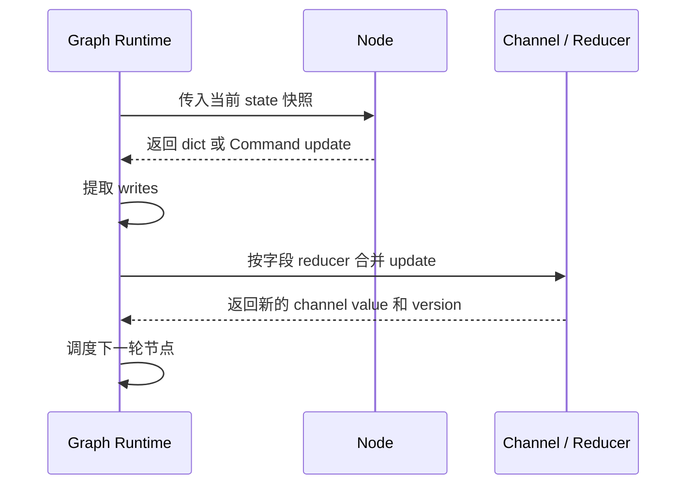

只有状态更新必须经过 runtime，runtime 才有机会统一做并发控制、checkpoint、resume、streaming 和 debug。

## 5. Graph 是声明，Pregel 才是执行

`StateGraph` 更像 builder。你调用 `add_node`、`add_edge`、`add_conditional_edges`，是在声明图的结构。真正的执行发生在 `compile()` 之后：

```python
graph = builder.compile()
```

编译后得到的 `CompiledStateGraph` 继承自 Pregel 运行时，才真正拥有这些方法：

```python
graph.invoke(...)
graph.stream(...)
graph.ainvoke(...)
graph.astream(...)
```

可以粗略分成两层：

```text
StateGraph
  负责声明：状态 schema、节点、边、条件分支、默认策略

Pregel runtime
  负责执行：计划任务、并发运行、合并写入、保存 checkpoint、输出 stream
```

> 图 5：`compile()` 是从友好 API 到运行时结构的转换点。

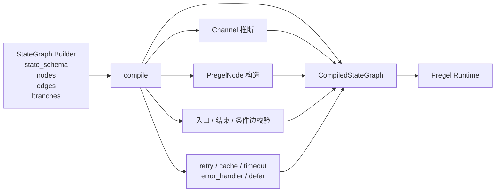

源码里，`CompiledStateGraph.attach_node()` 是一个关键转换点。它会把用户写的函数节点翻译成运行时能理解的 `PregelNode`：这个节点订阅哪些 channel、读取哪些 state key、返回值如何变成 channel writes、是否带 retry/cache/timeout/error handler。

这也是 LangGraph 很关键的设计取舍：公开 API 尽量贴近“写普通 Python 函数”，但 compile 阶段会把这些声明转换成更适合执行、恢复和观察的运行时结构。

## 6. Pregel/BSP 在源码里怎么落地

表面上看，下面这行代码像是在说：“`tools` 执行完之后调用 `agent`”。

```python
builder.add_edge("tools", "agent")
```

但 LangGraph 内部不是函数互相调用的模型，而是更接近数据驱动的模型：

```text
tools 产生写入
  ↓
写入进入 channel
  ↓
channel version 变化
  ↓
agent 订阅的触发条件满足
  ↓
下一轮调度 agent
```

这里要先澄清一点：LangGraph 借鉴的是 Pregel/BSP 的执行语义，不是说开源 Python 运行时本身就是一个分布式图计算系统。开源版 `PregelLoop` 更准确地说是一个单机协调器：同步路径用线程池并发，异步路径用 `asyncio.Task` 并发，外层用 BSP 的 barrier 组织每一轮执行。

一次运行可以简化成这条源码链路：

```text
Pregel.stream()
  ↓
SyncPregelLoop / AsyncPregelLoop
  ↓
PregelLoop.tick()
  ↓
prepare_next_tasks()
  ↓
PregelRunner.tick()
  ↓
task 执行并产生 writes
  ↓
PregelLoop.after_tick()
  ↓
apply_writes()
  ↓
进入下一轮 tick
```

> 图 6：一次 `stream()` 的源码主路径。

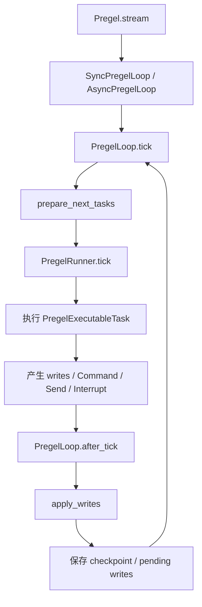

这里有三个数据结构非常关键。

第一是 `channel_versions`。每个 channel 都有自己的版本。只要某个 channel 的值发生变化，它的 version 就会推进。

第二是 `versions_seen`。它记录每个节点已经看过哪些 channel version。一个节点是否需要再次运行，不是看“图上有没有边”，而是看它订阅的 channel 当前版本是否比它上次看到的版本更新。

```text
channel_versions:
  messages -> v5
  tools    -> v2

versions_seen[agent]:
  messages -> v4
  tools    -> v2

因为 agent 看到的 messages 还是 v4，而当前是 v5，所以下一轮要调度 agent。
```

第三是 `updated_channels`。每一轮 `apply_writes()` 后，runtime 会记录本轮真正发生变化的 channel。下一轮 plan 时，可以围绕这些变化准备任务，而不是盲目扫描和重跑所有节点。

这对循环图尤其重要。比如经典的 `agent -> tools -> agent`，如果只根据边调度，很容易无限触发；如果只根据字段是否存在，又会漏掉后续更新。`channel_versions + versions_seen` 给了 runtime 一个精确判断：节点是否已经看过这次更新。

更具体地看，BSP 三阶段在源码里的职责大致是：

```text
Plan: PregelLoop.tick() / prepare_next_tasks()
  - 根据 updated_channels、channel_versions、versions_seen 选择要运行的节点
  - 生成 PregelExecutableTask
  - 处理 PULL task 和 PUSH task

Execute: PregelRunner.tick()
  - 并发执行本轮任务
  - 每个 task 调用自己的 PregelNode
  - 任务产生 writes，但不直接修改全局 channel

Update: PregelLoop.after_tick() / apply_writes()
  - 对本轮 writes 分组
  - 更新 versions_seen
  - 调用各 channel 的 update() 合并写入
  - 推进 channel_versions
  - 生成新的 checkpoint
```

PULL task 是常规图调度：某个节点订阅的 channel 更新了，所以它被拉起来执行。PUSH task 则来自 `Send(...)`：某个节点在运行时动态投递任务，比如 map-reduce 里为每个 item 启动一个 worker。

这也说明 LangGraph 的 Pregel 并不只表达静态边。它既能根据 channel 变化触发节点，也能通过 `Send` 做动态 fan-out，而这些动态任务仍然进入同一套 checkpoint、stream 和 retry 机制。

## 7. Command 和 Send：动态控制流也要进入 Runtime

静态边能表达固定流程：

```python
builder.add_edge("tools", "agent")
```

条件边能表达分支：

```python
builder.add_conditional_edges("agent", should_continue)
```

但 agent 经常需要更动态的控制流：LLM 一次生成多个 tool calls，map-reduce 根据输入动态 fan-out，人工审核后跳到不同节点，工具执行后直接更新状态并改变路径。

LangGraph 用 `Send` 和 `Command` 表达这些情况。

`Send` 常用于动态分发任务：

```python
from langgraph.types import Send


def dispatch(state: State):
    return [
        Send("worker", {"item": item})
        for item in state["items"]
    ]
```

`Command` 用来同时表达 state update 和 goto：

```python
from typing_extensions import Literal
from langgraph.types import Command


def route(state: State) -> Command[Literal["tools", "review", "__end__"]]:
    if state["needs_review"]:
        return Command(goto="review")

    if state["tool_calls"]:
        return Command(goto="tools")

    return Command(goto="__end__")
```

关键点仍然不是语法，而是边界。

这些动态控制流仍然进入 Pregel runtime。它们会变成 task、channel write、checkpoint 和 stream event，而不是在 node 里直接调用下一个 node。

> 图 7：动态控制流仍然回到 runtime，而不是节点私下互调。

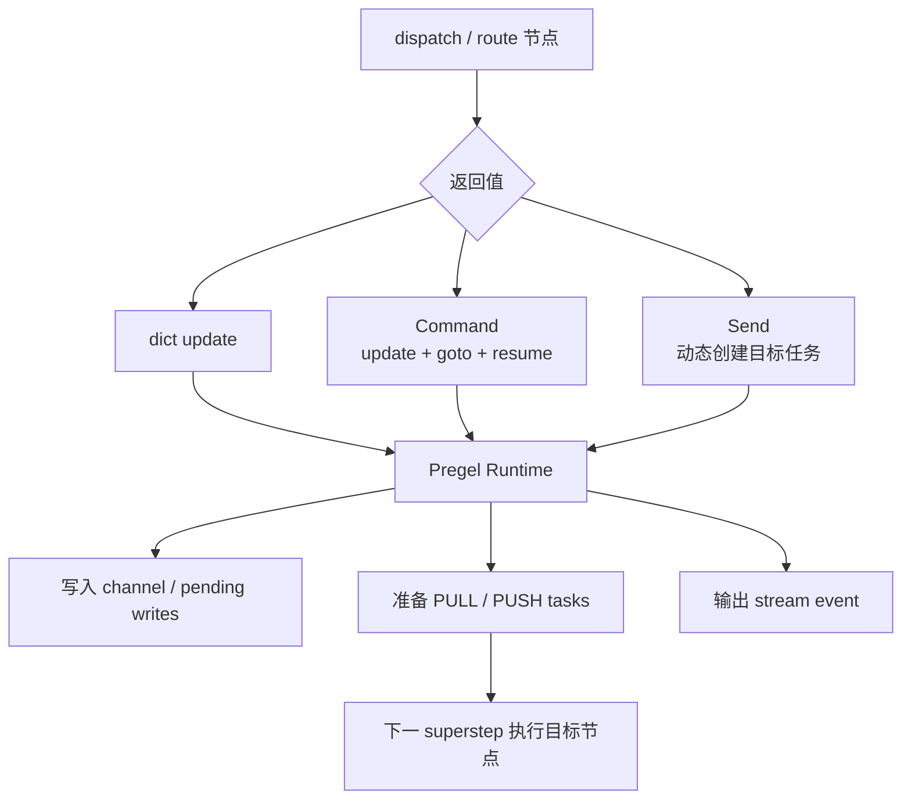

这保证了 runtime 始终掌握调度权，也能继续统一处理恢复、观察、重试和持久化。

这个边界对多 agent 组合也很重要。编译后的 graph 本身也是 runnable，所以子图可以作为父图里的一个节点运行。checkpoint 通过 `checkpoint_ns` 隔离父子图的恢复边界，stream 和 interrupt 也能沿用同一套语义。这比为 supervisor、worker、team 各自再发明一套协议更稳。

## 8. Checkpoint：保存的是运行时状态，不只是最终结果

先用一句人话定义：checkpoint 不是“把最终答案存下来”，而是“让 runtime 以后能从这里继续跑”的保存点。

很多人会把 checkpoint 理解成“把当前 state 存一下”。但 LangGraph 的 checkpoint 更像带执行光标的运行时快照。它不仅保存当前值，还保存运行时继续调度所需的信息：

```text
channel_values:
  当前对节点可见的业务状态

channel_versions:
  每个 channel 的变更计数器

versions_seen:
  每个节点已经读到哪个版本，类似它自己的“读指针”

pending_writes:
  已完成 task 的中间写入，但还没跨过 barrier 成为下一个稳定快照
```

不必记住字段名本身，只要记住 checkpoint 至少要回答三件事：现在状态是什么、节点已经看过什么、哪些结果已经完成但还没稳定落盘。

为什么需要 `pending_writes`？

假设某个 superstep 里并行调用 5 个工具：

```text
tool_a 成功
tool_b 成功
tool_c 成功
tool_d 失败
tool_e 还没完成

这时进程崩了。
```

如果只保存一个 state，恢复时很难判断哪些工具已经成功、哪些写入应该保留、哪些任务需要重跑。换句话说，只存 state 更像拍了一张截图；而 checkpoint 还要把“运行到哪里了”一起存下来。

LangGraph 把 checkpoint 写入拆成两层：

```text
put_writes():
  task 级中间写入。单个 task 结束后先保存，还没跨过 superstep barrier。

put():
  superstep 级稳定快照。apply_writes() 之后保存正式 checkpoint。
```

> 图 8：checkpoint 同时保存稳定快照和未跨过 barrier 的 pending writes。

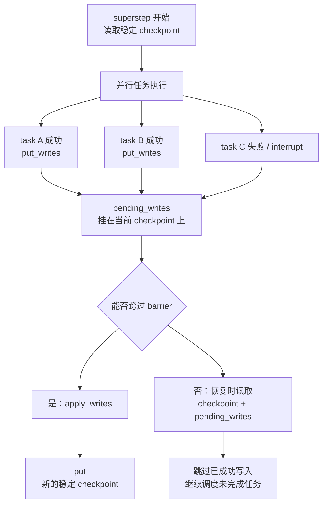

恢复时，runtime 读取的是“稳定 checkpoint + 挂在其上的 pending writes”。这让它可以从最近一致点继续，而不是从头重跑整个 agent。

这就是 durable execution，也就是耐久执行的基础。

实际运行时，持久化还可以在可靠性和吞吐之间做取舍。LangGraph 的执行参数里有 `durability` 概念，典型模式可以理解为：

```text
sync:
  等 checkpoint 写入完成后再进入下一步，可靠性优先

async:
  checkpoint 后台写入，吞吐优先

exit:
  运行结束时再持久化，适合对中间恢复要求不高的场景
```

这进一步说明：checkpoint 不是一个外置保存按钮，而是运行时调度策略的一部分。它回答的问题不是“要不要保存结果”，而是“失败之后，系统能不能从中间继续”。

## 9. Interrupt：人工介入不是阻塞进程

Agent 里很常见的一类需求是 human-in-the-loop：工具调用前审批，高风险动作前确认，让用户补充信息，或者从某个历史点重新执行。

最朴素的做法是在程序里阻塞等待用户输入。但这不适合长期运行的 agent。如果用户几小时后才回复，进程不能一直挂着。如果同时有很多 agent 等待人工审批，更不能把执行上下文都留在内存里。

LangGraph 的做法是 `interrupt()`。

```python
from langgraph.types import interrupt


def review(state: State):
    approved = interrupt({
        "action": state["pending_action"],
        "question": "是否批准这个动作？",
    })

    return {"approved": bool(approved)}
```

恢复时，调用方用 `Command(resume=...)` 把人工输入送回 graph。

> 图 9：`interrupt()` 把人工等待建模成可恢复的控制流。

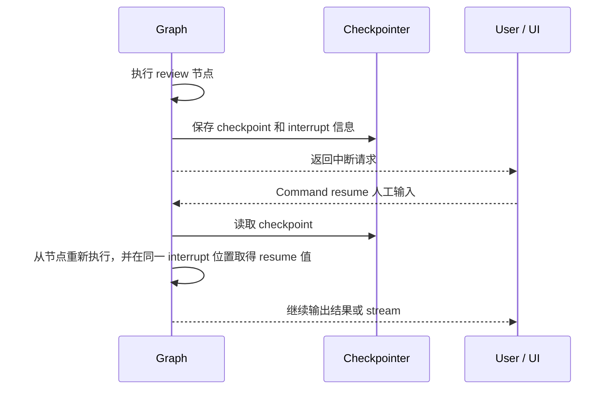

这个机制的关键是：interrupt 依赖 checkpoint。暂停不是让 Python 进程睡在那里，而是把当前运行状态持久化，返回给调用方。之后无论隔几秒、几小时，甚至换一台机器，都可以从 checkpoint 恢复。

但这里有一个工程约束：interrupt 前的副作用要小心。

因为恢复时节点可能会从头重新执行。如果 interrupt 前已经发邮件、扣款、写外部系统，就必须保证这些动作幂等，或者把不可重复的副作用放到人工确认之后。

## 10. Runtime / Store：区分本次运行和长期记忆

到这里，状态、控制流和恢复都已经进入 runtime。还有一个容易混淆的边界：哪些东西应该放进 graph state，哪些东西应该作为运行期上下文传入，哪些东西应该进入长期存储。

一个实用区分是：

```text
State:
  本次 graph 运行中会被节点读写、被 checkpoint 保存、参与恢复的业务状态。

Runtime context:
  本次调用需要的外部上下文或依赖，比如 user_id、tenant_id、配置项、客户端句柄。

Store:
  跨线程、跨运行保存的长期记忆或业务数据，比如用户偏好、历史事实、可搜索记忆。
```

这三者如果混在一起，graph 的职责很快会变得模糊。把所有东西都塞进 state，会让 checkpoint 变成一个越来越大的业务数据库；把长期记忆塞进运行期上下文，又会让恢复和多轮调用失去稳定来源。

LangGraph 的取舍是让 state 专注于“这次运行如何继续”，让 runtime context 承载“这次调用依赖什么”，让 store 负责“跨运行需要记住什么”。这样 agent 既能恢复当前流程，也能读取长期记忆，但两类生命周期不会互相污染。

> 图 10：state、runtime context 和 store 分别承担不同生命周期。

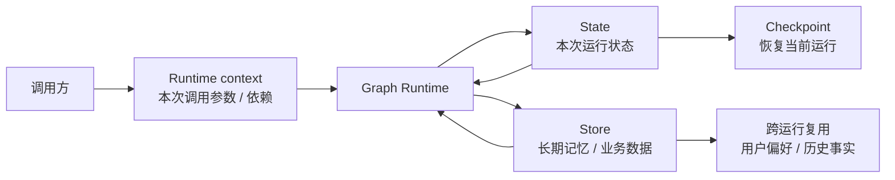

这也是 LangGraph 不把 agent 简化成“一个带记忆的函数”的原因。运行中的状态、调用时的上下文、跨运行的记忆，生命周期不同，可靠性要求也不同，应该由不同抽象承接。

## 11. Streaming：它不只是 token 流，而是运行时事件流

如果说 checkpoint 解决的是“断了以后从哪里继续”，streaming 解决的就是“运行过程中，外部如何持续看见它”。

手写 agent loop 时，大家对 streaming 的第一反应通常是 token 输出：模型一边生成，前端一边显示。这当然重要，但一旦 agent 进入运行时，真正值得被持续送到外部的就不只是 token 了。状态刚刚怎么变了、哪个 task 开始了、哪个 task 失败了、checkpoint 何时生成、节点想主动上报什么进度，这些都属于执行现场的一部分。

在 LangGraph 里，streaming 和 checkpoint 一样，都不是挂在 graph 外面的一层补丁。它直接长在同一个执行循环里：task 执行、写入合并、checkpoint 生成、LLM 输出、节点自定义事件，都可以在发生时被 runtime 向外发出去。所以它既服务聊天 UI，也服务状态观测、运行诊断和业务 telemetry。

因此，理解这些 stream mode，最好不要把它们当成几种“返回值类型”，而要把它们当成 runtime 打开的几扇观察窗。你关心哪一层，就订阅哪一种 mode。

| 观察窗 | stream mode | 你会看到什么 | 它更像在回答什么问题 |
|---|---|---|---|
| 状态增量 | `updates` | 每个节点或 task 刚刚写入了什么 | “谁改了什么？” |
| 状态快照 | `values` | 每一步之后的完整 state | “全局状态现在长什么样？” |
| 模型输出 | `messages` | LLM 的 token / message chunk 以及对应 metadata | “模型此刻在输出什么？是哪次调用、哪个 node 发出来的？” |
| 业务事件 | `custom` | 节点或工具通过 `StreamWriter` 主动发出的任意数据 | “这一步想对外汇报什么进度或信号？” |
| 运行时事件 | `tasks` | task 的开始、结束、结果和错误；通常要配合 checkpointer | “现在跑到哪了？哪里卡住或失败了？” |
| 运行时事件 | `checkpoints` | checkpoint 创建时的事件和对应数据，格式接近 `get_state()`；通常要配合 checkpointer | “什么时候形成了一个可恢复的保存点？” |
| 深度调试 | `debug` | 比 `tasks` / `checkpoints` 更完整的调试视图 | “如果要还原现场，runtime 当时到底看到了什么？” |

这里最容易混淆的有三点。

第一，`messages` 暴露的不是 graph state 里的 `messages` 字段，而是 LLM 调用过程中的输出片段和元数据。

第二，`checkpoints` 也不等于恢复本身。恢复能力来自 checkpointer 和 checkpoint 协议；`checkpoints` mode 只是把 checkpoint 创建这一刻的事件和对应数据显式暴露出来。

第三，`debug` 不是一个额外的新层，而是 runtime 把自己已经知道的调度和持久化信息尽量完整地暴露出来。它适合深度排障，但不一定是日常默认选项。

> 图 11：同一次 graph 执行，会向外打开不同层次的观察窗。

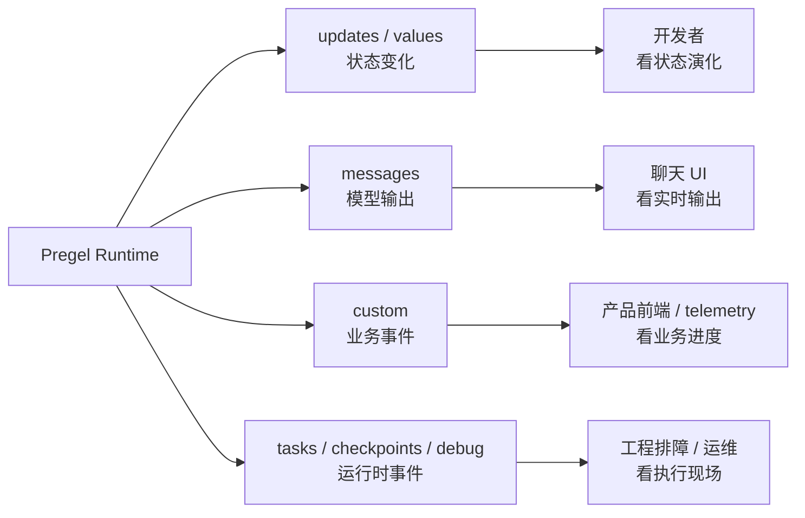

这也是结构化 agent 的价值之一。只要执行被拆成 node、task 和 superstep，runtime 就天然拥有稳定的观察点。于是 streaming 不再只是“把 token 往外吐”，而是把整个执行循环变成了一个可观察的外部接口。

所以更准确的总结是：

```text
checkpoint 让运行可以从中间继续。
streaming 让运行过程本身对外可见。
```

把这两件事放在一起看，LangGraph 强调的就不只是执行能力，而是运行时能力：它既负责把事情跑完，也负责让你在过程中看清楚发生了什么。

## 12. 总结：LangGraph 的精髓是运行时抽象

如果只把 LangGraph 理解成 `create_react_agent`，会低估它。

LangGraph 的核心不是某个 agent 模板，而是一组底层抽象：

```text
State schema:
  定义状态形状

Channel / reducer:
  定义状态更新和并发合并语义

Node:
  定义局部计算

Edge / Send / Command:
  定义控制流

Pregel superstep:
  定义并发边界

Checkpoint:
  定义恢复能力

Runtime / Store:
  区分运行状态、调用上下文和长期记忆

Stream:
  定义可观察性
```

这些抽象合在一起，构成了 LangGraph 的真正价值：

```text
LLM 只是节点之一。
工具只是节点之一。
人工输入也是控制流的一部分。
状态变化必须显式。
并发写入必须有语义。
失败恢复必须纳入运行模型。
观察能力必须贴近执行循环。
```

LangGraph 的重点不是把 agent 包装成更复杂的黑盒，而是把状态、控制流、并发、恢复和观察都放到显式运行时里。

当 agent 开始长期运行、并发调用工具、等待人工输入、从失败中恢复时，`while True` 就不再够用。LangGraph 处理的正是这层运行时复杂度。
