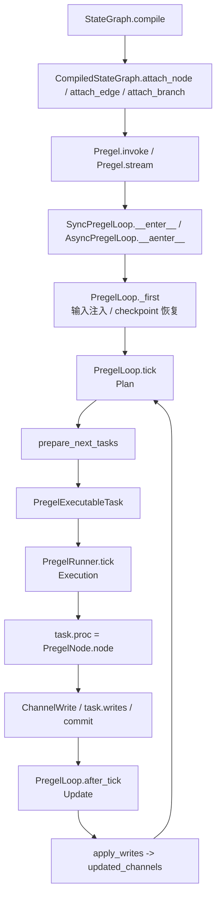
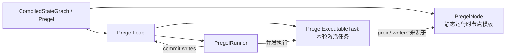

# LangGraph 仓库设计与代码职责读书笔记

本文面向准备开发 agent 项目的工程师，目标不是复述 API，而是提炼这个仓库背后的设计取舍：LangGraph 如何把 agent 从“一个循环调用 LLM 的函数”提升为可恢复、可观察、可并发、可组合的状态机运行时。

## 目录

- [一句话理解](#一句话理解)
- [Monorepo 分层](#monorepo-分层)
- [核心心智模型](#核心心智模型)
- [这些设计分别在解决什么问题](#这些设计分别在解决什么问题)
- [从输入到输出的运行路径](#从输入到输出的运行路径)
- [Graph API 的职责边界](#graph-api-的职责边界)
- [Node 输出与 State 更新语义](#node-输出与-state-更新语义)
- [Channel 与 reducer 的设计价值](#channel-与-reducer-的设计价值)
- [Reducer 覆盖：`Overwrite`](#reducer-覆盖overwrite)
- [DeltaChannel：增量存储与可恢复重建](#deltachannel增量存储与可恢复重建)
- [`Send` 和 `Command`：动态控制流](#send-和-command动态控制流)
- [Subgraph 与 namespace](#subgraph-与-namespace)
- [Checkpoint 持久化协议](#checkpoint-持久化协议)
- [Store / Cache / SerDe](#store--cache--serde)
- [Runtime 注入：`Runtime` 与 `ToolRuntime`](#runtime-注入runtime-与-toolruntime)
- [Prebuilt agent 的真实位置（含 deprecation 说明）](#prebuilt-agent-的真实位置含-deprecation-说明)
- [Functional API 的定位](#functional-api-的定位)
- [Streaming 与 observability](#streaming-与-observability)
- [Stream v3 与 transformer](#stream-v3-与-transformer)
- [错误处理、重试、缓存和超时](#错误处理重试缓存和超时)
- [CLI 和 SDK 的职责](#cli-和-sdk-的职责)
- [RemoteGraph 和 Server/UI 扩展](#remotegraph-和-serverui-扩展)
- [值得吸收的设计理念](#值得吸收的设计理念)
- [如果你要开发自己的 agent 项目](#如果你要开发自己的-agent-项目)
- [推荐阅读顺序](#推荐阅读顺序)
- [最值得记住的抽象](#最值得记住的抽象)
- [会话补充：源码问答摘要](#会话补充源码问答摘要)

## 一句话理解

LangGraph 的核心不是某一种 agent prompt 或某个 ReAct 模板，而是一个低层级的状态化编排框架：

- 用 `StateGraph` 描述“节点如何读取和更新共享状态”。
- 用 channel/reducer 定义并发写入时的合并语义。
- 编译成 `Pregel` 运行时后，按 superstep 执行节点，节点之间只通过 channel 版本化状态通信。
- 每个 superstep 都可以 checkpoint，所以失败恢复、人工中断、time travel、长期运行都不是外置补丁，而是运行模型的一部分。
- `prebuilt` 只是用这些底层能力拼出来的常见 agent 模式参考实现；当前的 prebuilt agent 已经在迁移到 `langchain.agents.create_agent` + middleware 体系（详见下文 [Prebuilt 一节](#prebuilt-agent-的真实位置含-deprecation-说明)）。

如果要吸收它的精髓，重点不是学某一个 `create_xxx_agent`，而是理解“显式状态 + channel 合并语义 + superstep 调度 + checkpoint”这组底层抽象。

## Monorepo 分层

仓库按 `libs/` 拆成多个可独立发布的库。依赖方向整体是从抽象到实现、从本地运行时到部署接口。

| 目录 | 职责 | 重点代码 |
|---|---|---|
| `libs/langgraph` | 核心框架。提供 Graph API、Functional API、Pregel 运行时、channel、streaming、interrupt、runtime 注入、RemoteGraph 和 UI state helper 等能力 | `langgraph/graph/state.py`, `langgraph/pregel/main.py`, `langgraph/pregel/_loop.py`, `langgraph/pregel/_algo.py`, `langgraph/pregel/remote.py`, `langgraph/stream/*.py`, `langgraph/graph/ui.py`, `langgraph/channels/*.py`, `langgraph/runtime.py`, `langgraph/types.py`, `langgraph/func/__init__.py` |
| `libs/prebuilt` | 高层 agent 和 tool 组件。源码位于 `langgraph.prebuilt` namespace，用核心 graph primitives 组合常见 agent 模式（`create_react_agent` 已 deprecate，转向 `langchain.agents.create_agent`，但 `ToolNode` 仍是核心可用组件） | `prebuilt/chat_agent_executor.py`, `prebuilt/tool_node.py` |
| `libs/checkpoint` | checkpoint、store、cache、serde 的基础接口和内存实现 | `checkpoint/base/__init__.py`, `checkpoint/memory/__init__.py`, `checkpoint/serde/{jsonplus,_msgpack,encrypted,event_hooks}.py`, `store/base/__init__.py`, `cache/base/__init__.py`, `cache/memory/__init__.py`, `cache/redis/__init__.py` |
| `libs/checkpoint-sqlite` | SQLite checkpointer/store/cache 实现，适合轻量本地或 demo | `checkpoint/sqlite/*.py`, `store/sqlite/*.py`, `cache/sqlite/*.py` |
| `libs/checkpoint-postgres` | Postgres checkpointer/store 实现，面向生产持久化。同时提供 `ShallowPostgresSaver`（只保留最新 checkpoint，无 time travel 但成本更低） | `checkpoint/postgres/__init__.py`, `checkpoint/postgres/shallow.py`, `checkpoint/postgres/aio.py`, `store/postgres/*.py` |
| `libs/checkpoint-conformance` | checkpointer 合规测试套件，约束第三方持久化实现的行为 | `checkpoint/conformance/spec/*.py` |
| `libs/cli` | LangGraph 应用创建、开发、本地服务、Docker 构建和部署入口。读取 `langgraph.json`、解析依赖、生成 Dockerfile、注入 `langgraph-api` 运行时 | `langgraph_cli/cli.py`, `langgraph_cli/config.py`, `langgraph_cli/docker.py`, `langgraph_cli/templates.py`, `langgraph_cli/schemas.py` |
| `libs/sdk-py` | 调用 LangGraph Server / LangSmith Deployment REST API 的 Python SDK，覆盖 assistants/threads/runs/store/**cron**、远程 streaming、auth、encryption 等资源 | `langgraph_sdk/_async`, `langgraph_sdk/_sync`, `langgraph_sdk/stream/`, `langgraph_sdk/auth/`, `langgraph_sdk/encryption/` |
| `libs/sdk-js` | JS SDK 已迁移到独立仓库 [`langchain-ai/langgraphjs`](https://github.com/langchain-ai/langgraphjs)，这里只保留 README 指引 | `README.md` |

依赖箭头 `A → B` 表示 A 依赖 B：

```text
langgraph              → checkpoint, sdk-py, prebuilt
cli                    → sdk-py
prebuilt               → checkpoint
checkpoint-postgres    → checkpoint
checkpoint-sqlite      → checkpoint
checkpoint-conformance → checkpoint
sdk-js                 独立仓库
```

注意：上图按各库 `pyproject.toml` / `package.json` 中声明的 production dependencies 统计。`libs/prebuilt` 源码在 monorepo 内会导入 `langgraph` 核心模块，但当前 `libs/prebuilt/pyproject.toml` 没把 `langgraph` 声明为 production dependency；发布依赖关系上是 `langgraph` 依赖 `langgraph-prebuilt`。

这个拆分体现了一个重要理念：运行时、持久化协议、具体存储、预置 agent、部署/SDK 是不同稳定层级。agent 框架要长期演进，不能把“怎么跑图”和“怎么存图状态”绑死在同一个包里。

## 核心心智模型

### 1. Graph 是声明，Pregel 是执行

用户通常写的是：

```python
builder = StateGraph(State)
builder.add_node("agent", call_model)
builder.add_node("tools", tool_node)
builder.add_conditional_edges("agent", should_continue)
graph = builder.compile(checkpointer=checkpointer)
```

这段代码构建的不是立即执行的对象，而是一个声明式 builder。`compile()` 会把 `StateGraph` 转成 `CompiledStateGraph`，后者继承 `Pregel`，真正具备 `invoke()`, `stream()`, `ainvoke()`, `astream()` 等运行能力。

对应源码：

- `StateGraph` 定义 builder 行为：`libs/langgraph/langgraph/graph/state.py`
- `CompiledStateGraph` 把 state schema、节点、边、分支翻译成 Pregel channel 和 node：`libs/langgraph/langgraph/graph/state.py`
- `Pregel` 管理运行行为：`libs/langgraph/langgraph/pregel/main.py`

这个分离让框架可以先做静态校验、schema 推断、channel 构造、默认策略注入，再进入运行时。

### 2. 节点不是互相调用，而是读写 channel

`StateGraph` 对外表现为“节点接收 State，返回 Partial State”。内部会把每个 state key 变成一个 channel，并把“节点 A 写 channel X → 节点 B 订阅 channel X → 下一 superstep 触发 B”作为唯一的节点间通信方式：

```text
edge(a, b) 在 Pregel 内部不是“a 调用 b”
而是 "a 写 channel(a) → b 的 triggers 包含 channel(a) → 下一 superstep 调度 b"
```

也就是说，`add_edge` 实质上是在配置 channel 的订阅关系；`add_conditional_edges` 是在运行时动态决定写哪些 channel；`Send` 是在跳过常规 channel 路径直接给目标节点投递一个独立任务。

每个 state key 对应的 channel 类型由 schema 推断（详见 [Channel 与 reducer 的设计价值](#channel-与-reducer-的设计价值)）。这个设计非常适合 agent，因为 agent 状态通常既有“最后结果”字段，也有“追加式消息列表”、工具结果集合、分支并行结果等不同合并语义。LangGraph 把这些并发语义放进 channel，而不是散落在节点代码里。

### 3. Superstep 带来可控并发

Pregel 运行时采用 Bulk Synchronous Parallel 模型。每一轮 superstep 包含：

1. Plan：根据上一步更新过的 channel 版本和每个节点的 `versions_seen`，决定本步哪些节点要运行。
2. Execution：并发执行这些节点。节点在本步内看不到其它节点刚写出的值，只读到上一步合并完成的快照。
3. Update：所有节点结束后，把它们的写入统一应用到 channel，并推进 channel version。

源码中的关键路径：

- `Pregel.stream()` 建立运行上下文并驱动循环：`libs/langgraph/langgraph/pregel/main.py`
- `SyncPregelLoop` / `AsyncPregelLoop` 管理 checkpoint、输入、任务和生命周期：`libs/langgraph/langgraph/pregel/_loop.py`
- `PregelRunner` 执行本步任务：`libs/langgraph/langgraph/pregel/_runner.py`
- `apply_writes()` 合并本步写入并更新 channel version：`libs/langgraph/langgraph/pregel/_algo.py`
- `prepare_next_tasks()` 根据 channel version 和触发关系准备下一步任务：`libs/langgraph/langgraph/pregel/_algo.py`

这套模型解决了 agent 框架里最容易失控的问题：并发节点到底谁先改状态、失败后哪些节点要重跑、循环何时停止。它不是靠锁和回调堆起来的，而是靠“本步只读旧状态，下一步才看见写入”的边界来保证可解释性。

### 4. 状态持久化是运行模型的一部分

checkpoint 不是简单把最终结果写入数据库。LangGraph 保存的是运行时状态快照：

- `channel_values`：channel 当前值。
- `channel_versions`：每个 channel 的版本（`str | int | float`，第三方实现要保证单调递增，通常用字典序可比的字符串）。
- `versions_seen`：每个节点见过哪些 channel 版本，用于决定是否需要再次运行（这是“同一 channel 被反复写也不会无限触发同一节点”的关键）。
- `pending_writes`：当前 checkpoint 之上还未稳定下来的写入，覆盖三类含义：(a) 同 superstep 已成功任务的写入，用于断点恢复时跳过已完成任务；(b) interrupt 引发的 resume 占位；(c) 失败任务的 `__error__` 等系统写入。
- metadata：`source ∈ {input, loop, update, fork}`、`step`、`parents`（namespace → parent checkpoint_id）、`run_id`、`counters_since_delta_snapshot`（DeltaChannel 专用，beta）。

对应接口在 `BaseCheckpointSaver`：

- `put()` / `aput()`：保存 checkpoint。
- `put_writes()` / `aput_writes()`：保存中间写入。
- `get_tuple()` / `aget_tuple()`：读取 checkpoint + metadata + pending writes。
- `list()` / `alist()`：列出历史 checkpoint，支持 `before` 和 `filter`。
- `delete_thread()` / `delete_for_runs()` / `copy_thread()` / `prune()` 及其 `a` 前缀异步版本：线程/run 级生命周期管理。
- `get_next_version()`：生成下一个 channel 版本号。
- `get_delta_channel_history()`：DeltaChannel 重建专用，沿 `parent_config` 走到最近的 `_DeltaSnapshot`，累计 writes 还原状态。

这就是 durable execution 的基础。恢复运行时，框架不是“重新跑一遍完整函数”，而是从 checkpoint 中恢复 channel 状态、根据 `versions_seen` 继续调度，并用 `pending_writes` 避免重复执行已成功的节点。

### 5. Thread 是短期记忆边界，Store 是长期记忆边界

LangGraph 明确区分两种记忆：

- Checkpointer：以 `thread_id` 为主键保存一次会话/一次 workflow 的状态历史，支持 resume、interrupt、time travel。它更像“短期工作记忆 + 执行日志”。
- Store：通用 key-value / search store，跨 thread 保存用户偏好、长期资料、embedding index、TTL 数据等。它更像“长期记忆库”。

对应源码：

- checkpoint 抽象：`libs/checkpoint/langgraph/checkpoint/base/__init__.py`
- 内存 checkpoint：`libs/checkpoint/langgraph/checkpoint/memory/__init__.py`
- store 抽象：`libs/checkpoint/langgraph/store/base/__init__.py`（含 `embed.py` 的语义检索支持）
- Postgres/SQLite 具体实现：`libs/checkpoint-postgres`, `libs/checkpoint-sqlite`

设计启发：做 agent 项目时，不要把“对话历史”“运行恢复点”“用户长期偏好”“知识库检索”混成一个 memory 概念。它们的生命周期、查询方式、可靠性要求都不同。

### 6. Interrupt 是可恢复控制流，不是异常处理技巧

LangGraph 提供两种相互独立的人工介入机制：

- 命令式 `interrupt(value)`（`libs/langgraph/langgraph/types.py`）：在节点中暂停执行，把 `Interrupt` 暴露给调用方。恢复时调用方传入 `Command(resume=...)`，节点会**从头重新执行**，并在相同 interrupt 位置拿到 resume 值。
- 声明式 `compile(interrupt_before=[...], interrupt_after=[...])`：在 compile 时静态指定某些节点的前/后断点，不需要改节点代码。适合可视化调试和审计场景。

`interrupt()` 的关键约束：

- 依赖 checkpointer，因为暂停后必须能恢复运行状态。
- 节点会重新执行，所以 interrupt 前的副作用要么避免，要么具备幂等性（也可以借 `CachePolicy` 让昂贵步骤跳过重算）。
- resume 值按节点内 interrupt 调用顺序匹配；同一节点多个 interrupt 互相独立。
- human-in-the-loop 被建模为 graph 状态迁移，而不是 UI 层的特殊 case。

这个设计对 agent 很重要：人工审批、补充信息、工具调用确认、敏感动作拦截都可以落在同一套运行模型里，而不需要在 agent loop 外面写一堆暂停/恢复胶水代码。

## 这些设计分别在解决什么问题

前面的章节已经解释了 LangGraph 的主要抽象，但读源码时更有用的问题是：这些抽象到底在解决普通 agent loop 的什么工程痛点？可以用下面这条主线串起来：

```text
普通 agent loop 容易写成“LLM 调工具、工具再回 LLM”的函数循环。
LangGraph 要解决的是：这个循环一旦长期运行、并发运行、失败恢复、人工介入和服务化部署后，怎么仍然保持可解释、可恢复、可观察。
```

### `StateGraph`：解决回调链失控

直接写 `while True: llm(); tool(); ...` 的 agent loop 很快会遇到几个问题：中间失败后从哪里恢复、人工审批怎么插入、多个工具怎么并行、某一步是否可以重试、运行轨迹怎么观察。

`StateGraph` 的作用是把“业务流程结构”先声明出来：有哪些节点、节点读写哪些状态、什么条件下走哪条边。真正执行时再由 `Pregel` 运行时负责调度、checkpoint、stream 和恢复。这样用户写的是 agent 的逻辑拓扑，运行时掌握执行生命周期。

### Channel / reducer：解决并发状态冲突

agent 状态不是普通 dict。多个节点可能同时写 `messages`、`partial_results`、`final_answer`。如果用默认 dict merge，很容易出现“后写覆盖前写”“list 到底追加还是替换不清楚”“并发 bug 被静默吞掉”等问题。

LangGraph 把每个 state key 的更新语义前置到 channel/reducer：

- `LastValue` 表示单值字段，同一个 superstep 多写会报错。
- `BinaryOperatorAggregate` 表示可聚合字段，例如 list concat 或计数累加。
- `add_messages` 这类 reducer 表示按消息 ID 合并和覆盖。
- `Topic`、`NamedBarrierValue`、`DeltaChannel` 等 channel 进一步表达发布订阅、等待汇合、增量存储等不同语义。
- `Overwrite` 可以在少数场景下绕过 reducer，直接替换一个聚合 channel 的值，但同一 superstep 只能有一个覆盖写。

这解决的是：并发合并规则不应该藏在节点内部，也不应该靠运行顺序碰运气。状态 schema 本身要表达执行语义。

### Superstep：解决并发可见性混乱

如果节点 A 和 B 并发运行，A 写出的状态是否应该被 B 立刻看到？如果能立刻看到，执行顺序会影响结果；如果有时能看到、有时不能看到，恢复和测试都会变得不可解释。

Pregel 的 superstep 边界把问题固定下来：

```text
本轮节点都读取同一个旧快照
本轮写入先暂存
本轮结束后统一合并
下一轮节点才看到新状态
```

这带来的价值是确定性：同一个 step 内的节点天然并行，但它们看不到彼此的半成品写入。状态只在 step 边界推进。

### `channel_versions` / `versions_seen`：解决循环图调度

agent 图经常有环，例如 `agent -> tools -> agent`。如果只根据边调度，节点可能无限触发；如果只根据字段有没有值调度，字段被多次更新时又可能漏跑。

所以 checkpoint 里保存两组信息：

- `channel_versions`：每个 channel 当前版本。
- `versions_seen`：每个节点上次看到的 channel 版本。

调度时只要某个触发 channel 的当前版本大于该节点已见版本，就说明节点需要再次运行。这个机制解决的是循环图里的“该不该跑”问题，也是恢复后继续调度的基础。

### Checkpoint / pending writes：解决失败恢复不重复执行

只保存“当前 state”不足以做可靠恢复。比如同一个 superstep 里 5 个工具并行执行，3 个成功、1 个失败、1 个还没完成，进程崩了。恢复时如果不知道哪 3 个已经成功，就可能重复调用外部 API 或丢失已经完成的写入。

LangGraph 把稳定状态和中间写入分开：

- checkpoint 保存稳定的 channel 值、channel 版本、节点已见版本。
- `pending_writes` 保存某个 task 已经产生、但还没有进入下一个稳定 checkpoint 的写入。

这让恢复不是“从头再跑一遍函数”，而是从最近一致点继续，并尽量跳过已成功的任务写入。

### `interrupt()` / `Command(resume=...)`：解决人工介入不能阻塞进程

人工审批、补充信息、敏感动作确认都可能等待很久。不能让 Python 进程在节点里阻塞等用户输入，也不能把人工步骤放在 graph 外面变成一套旁路协议。

`interrupt()` 的语义是：节点暂停，把中断请求持久化并返回给调用方；用户之后用 `Command(resume=...)` 恢复；恢复时节点会从头重新执行，并在相同的 interrupt 位置拿到 resume 值。

这里最重要的工程约束是副作用幂等：interrupt 之前如果已经发邮件、扣款、写外部数据库，恢复时重跑节点可能再次触发这些动作。更稳妥的做法是把不可重复副作用放在审批之后，或者用幂等 key、事务记录、缓存策略保护。

### `Send` / `Command`：解决静态边不够表达动态控制流

LLM 输出的 tool calls 数量、map-reduce 的 item 数量、下一步是否走人工审核，都是运行时才知道的。静态边只能表达固定 workflow，不够表达这些动态分支。

`Send(node, arg, timeout=...)` 用来动态创建目标节点任务，常见于 fan-out；`Command(update=..., goto=...)` 用一个返回值同时表达状态更新和控制跳转。它们的关键价值是：动态控制流仍然进入 Pregel 的 task、channel、checkpoint、stream 机制，不会绕开运行时。

### Thread / Store：解决 memory 概念混乱

agent 项目里很容易把“对话历史”“恢复点”“用户长期偏好”“知识库检索结果”都叫 memory。LangGraph 明确拆开：

- checkpointer/thread 是短期工作状态和执行日志，用于 resume、interrupt、time travel。
- store 是跨 thread 的长期记忆，用于用户偏好、资料、embedding index、TTL 数据。

这个边界非常重要。否则清理一次 run 时可能误删长期记忆，或者长期用户画像被反复塞进 state/checkpoint，既浪费存储，也污染 prompt 边界。

### `Runtime` / `ToolRuntime`：解决依赖污染 state

节点经常需要 `user_id`、租户配置、db 连接、store、stream writer、heartbeat 等运行期能力。如果这些都塞进 state，会出现序列化困难、checkpoint 污染、内部依赖暴露给 LLM、schema 越来越脏等问题。

`Runtime` 把这些运行期能力显式注入节点，让 state 只保留需要持久化、可合并、可恢复的业务状态。`ToolRuntime` 进一步把 tool 场景需要的 state、tool_call_id、config 等注入给工具，同时避免这些参数出现在 LLM 可见的工具 schema 里。

### Subgraph / namespace：解决多 agent 组合时状态隔离

多 agent 系统通常会出现 supervisor、team、worker、工具子流程等层级。如果每层都有自己的 checkpoint 和 stream，必须解决命名冲突和恢复边界问题。

LangGraph 把编译后的 graph 也做成 Runnable，因此子图可以作为父图节点运行；checkpoint 通过 `checkpoint_ns` 隔离。这样多 agent 组合不需要新发明一套运行模型，父图、子图都共享同一套状态、stream、interrupt 和 checkpoint 语义。

### DeltaChannel：解决长历史状态的 checkpoint 成本

消息历史、事件日志、累加结果这类字段会持续增长。如果每个 superstep 都把全量值写入 checkpoint，存储成本和序列化成本会越来越高。

DeltaChannel 的思路是大部分时间只存增量，周期性写完整 snapshot。恢复时从最近 snapshot 加上后续 delta 重建当前值。它解决的是大状态持久化成本，但也给 checkpointer 带来更高约束：`prune`、`copy_thread`、`delete_for_runs` 不能随便切断 snapshot 到 head 之间的祖先链。

### Streaming / observability：解决生产排障只看到最终字符串

生产 agent 出问题时，最终回答通常不是最有价值的信息。真正需要的是：哪个节点开始了、哪个工具失败了、LLM token 流到哪一步、哪个 checkpoint 被创建、哪个 task 被 retry、state 如何变化。

所以 LangGraph 把 streaming 放在 Pregel 执行主路径里，而不是事后加一个 callback。`updates`、`values`、`messages`、`tasks`、`checkpoints`、`debug` 等模式分别面向不同观察粒度。

### Retry / cache / timeout / error_handler：解决失败语义混在一起

真实 agent 节点会调用 LLM、工具、数据库、远程 API，它们的可靠性画像不同。把所有失败都写成节点内部 `try/except` 会让控制流和业务逻辑混在一起。

LangGraph 把几种语义拆开：

- retry：同一个节点重跑，适合临时网络错误和限流。
- cache：同样输入跳过重算，适合昂贵或幂等的 LLM/tool 调用。
- timeout：保护资源，避免节点无限卡住。
- error_handler：失败后换一条 graph 路径，适合降级、补偿、人工处理。

这几个策略共同解决的是：节点可靠性应该声明化、可观测、可复用，而不是散落在业务代码里。

### 读这份笔记时的补充视角

从 review 角度看，本文已经覆盖了 LangGraph 的主要设计层次。更容易被忽略、但做生产 agent 时很关键的补充点是：

- 状态字段的 reducer 选择会影响正确性，不只是类型标注。默认 `LastValue` 对并发写是故意严格的。
- interrupt 前后的副作用边界要单独设计，尤其是发邮件、扣费、写外部系统这类不可重复动作。
- checkpointer 不是普通 KV 存储，`pending_writes`、namespace、delta history、`versions_seen` 都是协议的一部分。
- 短期 thread state、长期 store、运行期 context 三者要从项目第一版就分开。
- 高层 prebuilt agent 可以参考，但不应该把它当成 LangGraph 的核心抽象；核心抽象是 state、channel、superstep、checkpoint、runtime 和 stream。

## 从输入到输出的运行路径

一次 `graph.invoke()` 本质上会走 `stream()`，收集最后输出。核心流程可以概括为：

```text
用户输入
  ↓
Pregel.stream()
  ↓
构造 Runtime / callback / stream handlers / durability 设置
  ↓
进入 SyncPregelLoop 或 AsyncPregelLoop
  ↓
tick(): 根据 channel version 和 versions_seen 准备本 superstep 的 tasks
  ↓
PregelRunner 并发执行 tasks
  ↓
节点写入 ChannelWrite / Command / Send / Interrupt
  ├── 正常写入 ────────→ apply_writes(): 合并写入，更新 channel version → 保存 checkpoint / pending writes
  ├── 抛 GraphInterrupt → 把 interrupt 信息写进 pending_writes，保存 checkpoint，返回给调用方
  ├── 节点失败 ────────→ 若节点配置了 error_handler，路由到处理节点；否则按 RetryPolicy 重试或外抛
  └── defer 节点 ───────→ 不参与本步调度，等到所有非 defer 节点完成才执行
  ↓
输出 stream chunk（按 stream_mode 决定形状）
  ↓
继续下一 superstep，直到无任务、END、interrupt、drain 或 recursion limit
```

需要注意的设计细节：

- `invoke()` 是同步收集最终值，`stream()` 才是底层主入口。
- stream 支持 `values`, `updates`, `messages`, `custom`, `checkpoints`, `tasks`, `debug` 七种模式（定义在 `langgraph/types.py` 的 `StreamMode`），说明可观察性是运行时的一等能力。
- `durability` 有 `sync`, `async`, `exit` 三种模式（定义在 `langgraph/types.py` 的 `Durability`），允许在可靠性和吞吐之间权衡；旧的 `checkpoint_during=True/False` 已 deprecate。
- 子图也是 runnable，可以嵌套并继承或隔离 checkpointer，每个子图有独立的 `checkpoint_ns`。

## Graph API 的职责边界

`StateGraph` 是大多数应用最应该学习的 API。它负责：

- 接收 `state_schema`, `input_schema`, `output_schema`, `context_schema`（详见下方 schema 层级表）。
- 推断 state key 对应的 channel。
- 注册节点、边、条件边、入口和结束点。
- 给节点配置 retry、cache、timeout、error handler、defer。
- 校验图结构，例如必须有 `START` 到某个节点的入口。
- 编译成可执行 `CompiledStateGraph`，并允许 compile 时声明 `interrupt_before` / `interrupt_after`。
- compile 时注入 `checkpointer`、`cache`、`store` 和 v3 streaming `transformers`；运行时 `stream()` / `astream()` 也可以临时覆盖 interrupt 和 durability 等执行参数。

### Schema 层级

LangGraph 区分四类 schema，加上 managed value，可以解释“哪些字段是节点共享的状态，哪些是运行期依赖，哪些只约束 graph I/O，哪些不会进入工具 schema”：

| schema | 角色 | 是否进入 channel / 运行时状态 | 是否自动暴露给 LLM | 注入方式 |
|---|---|---|---|---|
| `state_schema` | 节点共享读写状态 | 是 | 否；只有节点或 prebuilt agent 显式把字段放进 prompt / model input 时才可见 | 节点入参 `state` |
| `input_schema` | 外部输入子集 | 仅 START 写入对应字段 | 否；它只约束 `invoke({...})` 输入形状 | `invoke({...})` 的入参形状 |
| `output_schema` | 外部输出子集 | 由对应字段映射 | 否；它只约束 `invoke()` 返回形状 | `invoke()` 的返回形状 |
| `context_schema` | 运行期 context（静态依赖，如 user_id、db 连接） | 否 | 否 | `Runtime.context` |
| managed value | 框架管理字段（如 `RemainingSteps`） | 作为 managed value 挂在运行时，不是普通 channel | 否 | 节点入参可读，但不出现在 IO schema |

设计启发：把“需要持久化的状态”、“运行期注入的依赖”、“不应进入 prompt 的内部信号”从一开始就分开，不要全塞进一个大 dict。

### `add_node` 选项

`CompiledStateGraph.attach_node()` 是理解内部转换的关键：它把一个用户节点转换成 `PregelNode`，并给它配置：

- `triggers`：什么 channel 更新会触发该节点。
- `channels`：节点读取哪些 state channel。
- `mapper`：是否把 dict 转成 Pydantic/dataclass/TypedDict 对应结构。
- `writers`：节点返回值如何被映射成 channel writes。
- `retry_policy`, `cache_policy`, `timeout`, `error_handler`：声明式策略。
- `defer`：标记节点延迟到运行末尾才执行，适合“总结 / 清理 / 记忆写入”等终态节点。
- `destinations`：静态声明该节点可能跳转到哪些下游，配合 `Command(goto=...)` 做类型校验和可视化。

全局默认可以用 `StateGraph.set_node_defaults(retry_policy=..., cache_policy=..., error_handler=..., timeout=...)` 一次性配置，单节点的 `add_node` 参数始终优先于默认值。默认值**不会**被子图继承。

设计启发：builder API 应该尽量贴近用户心智，但运行时结构可以完全不同。优秀框架会在 compile 阶段把友好的声明转换成可优化、可校验、可恢复的内部模型。

## Node 输出与 State 更新语义

理解 LangGraph 的 node，最容易混淆的是“Python 入参对象被修改了”和“Graph Runtime 的全局状态被更新了”。这两件事不是一回事。

更准确的心智模型是：

```text
Graph Runtime 保存真实状态
  ↓
运行某个 node 前，把当前状态读出来，组装成 node 的入参 state
  ↓
node 读取 state，计算结果
  ↓
node 返回 dict 或 Command(update=...)
  ↓
Graph Runtime 从返回值中提取 update
  ↓
Runtime 按 channel/reducer 规则把 update 合并回真实状态
  ↓
下一个 node 读取合并后的 state
```

所以并不是“下一个 node 去 update”，而是“当前 node 返回 update，由 Graph Runtime 在当前 node 结束后统一应用，下一步 node 再读取应用后的状态”。

### `add_node`、`add_edge` 和 node 返回值

`add_node("name", fn)` 的职责是把一个函数或 runnable 注册成图里的 node，并给它一个名字。如果不显式传名字，LangGraph 通常会用函数名。

`add_edge("a", "b")` 的职责是定义静态控制流：`a` 完成后触发 `b`。如果写的是 `add_edge(["a", "b"], "c")`，含义是等 `a` 和 `b` 都完成后再触发 `c`。

node 本身最常见的形式是接收 state，返回 state update：

```python
def node_a(state: State) -> dict:
    return {"x": state["x"] + 1}
```

这里返回的 dict 不是“完整新 state”，而是 partial update。Runtime 会把这个 update 写入对应的 state key/channel。下一个 node 看到的是已经合并后的 state：

```python
def node_b(state: State) -> dict:
    # 这里看到的 x 已经包含 node_a 返回的更新
    return {"y": state["x"] * 2}
```

如果 node 还想在同一步里决定下一跳，可以返回 `Command`：

```python
from typing_extensions import Literal
from langgraph.types import Command


def node_a(state: State) -> Command[Literal["node_b"]]:
    return Command(
        update={"x": state["x"] + 1},
        goto="node_b",
    )
```

`Command` 不是所有 node 必须返回的东西。普通 node 返回 dict 就够了；只有当一个 node 需要同时表达“状态怎么变”和“控制流往哪里走”时，才需要 `Command`。

### `Command` 为什么同时有 `update`、`goto`、`graph` 和 `resume`

`Command` 可以理解成运行时控制指令，而不是单纯的“下一跳”。

```python
Command(
    update=...,  # 更新 state
    goto=...,    # 调度下一个 node、多个 node，或 Send
    graph=...,   # 指令作用在当前 graph 还是最近父 graph
    resume=...,  # 从 interrupt 恢复时提供值
)
```

`update` 表示这次 node 执行后要合并进 graph state 的内容。它和普通 dict 返回值在“更新 state”这件事上是同一类语义：

```python
return {"classification": classification}
```

和：

```python
return Command(update={"classification": classification})
```

都能表达 state update。区别是后者还可以同时表达控制流。

`goto` 表示下一步要调度的目标。它可以是单个 node、多个 node、`END`，也可以是 `Send`：

```python
Command(goto="node_b")
Command(goto=["node_b", "node_c"])
Command(goto=END)
Command(goto=Send("worker", {"item": item}))
```

如果某个 node 既返回 `Command(goto="x")`，又存在静态边 `add_edge("that_node", "y")`，这不是“`goto` 覆盖静态边”，而是两条路由都可能生效。实践上同一个 node 的下游控制最好二选一：要么用静态/条件边，要么用 `Command(goto=...)`。

`graph` 主要服务 subgraph 场景。默认 `graph=None`，表示当前 graph。子图中的 node 如果要跳到最近父图的某个 node，可以返回：

```python
return Command(
    update={"foo": "bar"},
    goto="parent_node",
    graph=Command.PARENT,
)
```

这里 `goto` 的目标属于最近的父 graph。若从子图向父图更新共享 key，父图 state 上通常需要为这个 key 定义合适的 reducer，避免父子图状态合并语义不清。

`resume` 主要用于 `interrupt()`。图暂停后，调用方用 `graph.invoke(Command(resume=...), config)` 恢复执行。它不是常规 node 输出的核心字段，而是同一个控制对象被复用于“恢复中断”这个场景。

### 不要依赖原地修改入参 `state`

从 Python 语法上说，node 内部当然可以写：

```python
def node_a(state: State) -> dict:
    state["x"] = 10
    return {}
```

但这不是 LangGraph 语义上的 state update。LangGraph 正式认可的是 node 的返回值，而不是对入参对象的原地修改。正确写法应该是：

```python
def node_a(state: State) -> dict:
    return {"x": 10}
```

或者：

```python
def node_a(state: State) -> Command[Literal["node_b"]]:
    return Command(
        update={"x": 10},
        goto="node_b",
    )
```

可以把传给 node 的 `state` 理解成当前 step 的状态快照或输入视图。它代表 node 执行开始时能看到的状态，但它不是一个应该被各个 node 共享、原地修改的全局 dict。真正的全局状态由 Graph Runtime 管理，内部按 channel、版本和 checkpoint 推进。

特别需要小心 list/dict 这类 mutable 对象。下面这种写法有时可能“看起来”影响了后续执行，因为 Python 对象引用被原地改了：

```python
def node_a(state: State) -> dict:
    state["messages"].append(new_message)
    return {}
```

但这是绕过 Graph Runtime 的副作用，不应该依赖。更稳妥的写法是返回一条 update，让 reducer 负责合并：

```python
def node_a(state: State) -> dict:
    return {"messages": [new_message]}
```

如果 `messages` 在 state schema 里定义了 `add_messages` 之类的 reducer，Runtime 会按 reducer 规则把新消息合并进去。这样每一步写入都能被追踪、checkpoint、stream 和恢复。

### 为什么要这样设计

这个设计不是单纯的代码风格约束，而是 LangGraph 能支持长期运行、并发、恢复和可观测性的基础。

首先，state 更新需要统一合并。每个 state key 对应一个 channel，channel 可能是默认覆盖语义，也可能有 reducer，例如 list concat、消息 ID 合并、计数累加等。只有通过返回值提交 update，Runtime 才能按 schema 声明的语义正确合并。

其次，LangGraph 允许多个 node 在同一个 superstep 并行运行。它们都基于同一个旧状态快照计算 update，本 step 结束后再统一应用。如果 node 直接原地改共享对象，就会重新引入执行顺序、竞争条件和覆盖问题。

第三，checkpoint、resume 和 time travel 依赖“每一步到底写了什么”的明确记录。Runtime 需要知道某个 node 返回了哪些写入，才能保存 `channel_values`、`channel_versions`、`versions_seen` 和 `pending_writes`。原地 mutation 很难可靠地成为可恢复日志的一部分。

第四，retry、cache、streaming 和 debug 也依赖清晰的输入输出边界。node 的返回值是这一步的正式结果：stream 可以展示它，cache 可以复用它，retry 可以在失败时避免半写入污染全局状态，debug trace 可以解释状态为什么变成现在这样。

因此，LangGraph 的推荐模型可以总结为：

```text
node 入参 state：读取当前状态
node 返回 dict：提交 state update
node 返回 Command(update=..., goto=...)：提交 state update，并动态决定控制流
Graph Runtime：负责合并 update、推进 channel version、保存 checkpoint、调度下一步
```

这和 React/Redux 一类模型有相似之处：`state` 是当前快照，业务逻辑返回“变更描述”，runtime 负责应用变更。牺牲一点直接修改对象的自由，换来的是并行安全、可恢复、可追踪和可组合。

## Channel 与 reducer 的设计价值

agent 应用中最常见的状态冲突是“多个节点同时写同一个字段”。LangGraph 没有把这个问题留给用户随机处理，而是要求每个 key 有明确的更新语义。

典型例子：

```python
from typing_extensions import Annotated, TypedDict
import operator
from langgraph.graph.message import add_messages


class State(TypedDict):
    messages: Annotated[list, add_messages]
    partial_results: Annotated[list[str], operator.add]
    final_answer: str
```

含义是：

- `messages` 用消息 ID 合并和覆盖，适合 chat history。
- `partial_results` 用 list concat，适合 map-reduce。
- `final_answer` 默认 `LastValue`，适合单一最终结果。

这比“所有节点都返回 dict，然后深度 merge”更清晰。它把冲突解决策略前置到 schema 中，让状态结构本身表达执行语义。

### Channel 类型清单

`libs/langgraph/langgraph/channels/` 下的 channel 都实现了 `BaseChannel[Value, Update, Checkpoint]`：

| Channel | 触发？ | 合并语义 | 典型用途 |
|---|---|---|---|
| `LastValue` | 触发下游 | 单步内禁止多写（否则 `InvalidUpdateError`），跨步覆盖 | 最终结果、单值字段 |
| `BinaryOperatorAggregate` | 触发下游 | 用 reducer 函数（如 `operator.add`）合并多写 | 累加器、list/dict 拼接 |
| `Topic` | 触发下游 | 发布订阅队列，支持 list 写入扁平化，可配置是否跨 step 累积；当前实现不做去重 | 任务分发、消息总线 |
| `EphemeralValue` | 触发下游 | 保存上一步写入，下一次无写入时清空；它仍会进入 checkpoint，以便恢复时保持 step 边界语义 | 信号、一次性指令 |
| `AnyValue` | 触发下游 | 同一 superstep 可接受多个写入并保存最后一个；设计假设多写值等价，适合“不关心哪个相同值赢”的场景 | 多路相同信号、容忍重复写的状态位 |
| `NamedBarrierValue` / `NamedBarrierValueAfterFinish` | 等命名节点都写入后才触发 | 类似 BSP join | map-reduce、多 agent 等待 |
| `UntrackedValue` | 触发下游（当前运行内） | 保存最后一次写入并推进版本，但 `checkpoint()` 返回 `MISSING`，持久化 pending writes 时也会过滤该 channel | 不可序列化的运行期对象、只在当前执行中传递的资源 |
| `DeltaChannel` | 触发下游 | 非快照 step 不写入 `channel_values`，只通过 `checkpoint_writes` 保留增量；周期性写 `_DeltaSnapshot`；重建走 `get_delta_channel_history` | 大状态、长历史，降低 checkpoint 成本 |

特别提醒 `LastValue` 的并发语义：在同一个 superstep 内多个节点同时写 `LastValue` 通道会抛 `InvalidUpdateError`，只有跨 superstep 的覆盖才是“后写胜出”。如果多路写的是等价值、只想避免冲突，可用 `AnyValue`；如果是累加/合并，应配 reducer；如果是聚合字段偶尔需要清空或替换，应显式返回 `Overwrite(value=...)`。

managed value 不是 channel，它通过 `_get_channels()` 中专门的分支处理，不进入 IO schema，但节点可以读到（例如 `RemainingSteps` 用来感知剩余递归预算）。

## Reducer 覆盖：`Overwrite`

有 reducer 的字段默认会走聚合语义。例如 `Annotated[list, operator.add]` 会追加列表，`add_messages` 会按消息 ID 合并。这在大多数并发场景是正确的，但也有少数节点需要表达“这次不是追加，而是把这个聚合字段整体替换掉”，例如压缩消息历史、清空临时结果、重置累加器。

当前实现提供 `langgraph.types.Overwrite` 处理这个需求：

```python
from typing_extensions import Annotated, TypedDict
import operator
from langgraph.types import Overwrite


class State(TypedDict):
    messages: Annotated[list[str], operator.add]


def compact_messages(state: State) -> dict:
    return {"messages": Overwrite(value=["summary"])}
```

`Overwrite` 只对 `BinaryOperatorAggregate` 和 `DeltaChannel` 这类支持覆盖语义的聚合 channel 有意义。它不是“随便让最后写入赢”的逃生口：同一 superstep 内同一个 channel 收到多个 `Overwrite` 会抛 `InvalidUpdateError`，防止两个并发节点都声称自己要重置同一份状态。

设计启发：reducer 是默认合并规则，`Overwrite` 是显式的例外。业务代码应该让例外看得见，而不是把清空/替换藏在一个特殊 reducer 或隐式原地修改里。

## DeltaChannel：增量存储与可恢复重建

DeltaChannel 是这个仓库里比较新且有工程意义的设计。当 agent 状态本身就是“长链表 / 大 list / 持续累加”的形态（消息历史、向量索引、累加日志），常规 channel 每步都把全量值进 checkpoint，成本会随步数线性增长。DeltaChannel 把这件事改成增量：

- 非快照 step 的 `channel_values` 里不包含该 channel；该 step 的真实更新保存在 `checkpoint_writes` / `pending_writes` 里。
- 每隔 `snapshot_frequency` 次更新（或达到 `DELTA_MAX_SUPERSTEPS_SINCE_SNAPSHOT` 总步数上限）才把完整 `_DeltaSnapshot(value)` 写到 `channel_values[k]`。
- 状态重建时由 `BaseCheckpointSaver.get_delta_channel_history(config=..., channels=...)` 沿 `parent_config` 往上走，累计每个 channel 的 writes，直到遇到最近的 snapshot，组合出当前值。
- metadata 中的 `counters_since_delta_snapshot[channel] = (updates, supersteps)` 控制何时强制 snapshot。
- reducer 签名是 `reducer(state, list[writes]) -> new_state`，不是普通二元 `operator.add`。它必须确定性且对 batching 不敏感，因为恢复时可能把多步 writes 合批 replay。
- `Overwrite` 在 `DeltaChannel` 中会成为 replay 的重置点：最后一个 `Overwrite` 之前的 delta 被忽略，从覆盖值之后继续应用后续 writes。

这一设计带来两个运维约束，做自定义 checkpointer 时尤其要注意：

- `prune(strategy="keep_latest")` 不能盲删中间 checkpoint：如果删到最近 snapshot 之前的祖先，DeltaChannel 重建会**静默**得到空值（不会抛错）。安全做法是保留链路到 snapshot，或在保留的 checkpoint 上重写一份 snapshot。
- `copy_thread` 必须复制完整的父链，至少到最近 snapshot；只复制 head 会让目标线程读不到完整状态。
- `delete_for_runs` 删除某个 run 产生的写入时也要意识到可能切断别的 thread 的重建链路。

`libs/checkpoint/langgraph/checkpoint/base/__init__.py` 在 `prune` / `copy_thread` / `delete_for_runs` 的 docstring 里专门给出了 DeltaChannel 警告，新写一个 checkpointer 时把这些 case 跑通 conformance 就能避免上线后才发现的隐患。

## `Send` 和 `Command`：动态控制流

静态边能表达固定 workflow，但 agent 经常需要运行时动态分支：

- 根据 LLM 输出决定是否调用工具。
- 把多个 tool call 分发成并行任务。
- map-reduce 中为每个 item 动态启动一个节点。
- tool 执行后直接更新状态并跳转。

LangGraph 用两个基础类型处理：

- `Send(node, arg, timeout=...)`：向某个节点发送自定义输入，绕开常规 channel 路径，常用于动态 fan-out。每个 `Send` 在 Pregel 里就是一个独立 task；可选 `timeout` 会覆盖这次 pushed task 的节点默认 timeout。
- `Command(update=..., goto=..., resume=...)`：把状态更新、跳转、interrupt 恢复合在一个显式控制对象里。`goto` 可以是节点名，也可以是 `Send` 或它们的列表。

这让节点（以及工具，见下文 `ToolNode`）的返回值不仅能表达“写了什么状态”，还能表达“下一步控制流怎么走”。但这些控制流仍然进入 Pregel 的 channel/task/checkpoint 机制，不会绕开运行时。

工具返回 `Command` 是把工具从“纯函数”升级为“可写图状态”的关键开关，要小心：工具拿到的 state 可能是 `InjectedState`，写状态时要走 `Command(update=..., goto=...)`，而不是直接修改入参。

## Subgraph 与 namespace

编译后的图实现 LangChain `Runnable` 接口，因此可以作为更大 graph 的一个节点。这是多 agent / supervisor / team 模式的工程基础。

要点：

- 父图在调度子图节点时，会给子图分配一个 `checkpoint_ns`（用 `|` 分隔的命名空间），checkpoint 表的主键里就含这个 ns（见下文 Postgres 表结构）。
- 子图既可以**继承父图的 checkpointer**（默认；通过 ns 隔离命名空间），也可以传入独立的 checkpointer 形成完全隔离的存储；`checkpointer=False` 会显式禁用继承，`checkpointer=True` 只用于子图从父运行配置中启用持久化。
- `Pregel.get_subgraphs(namespace=..., recurse=...)` 可以按 ns 检索运行中的子图，便于调试和管理。
- `Send` 跨子图也成立：父图节点返回 `Send("subgraph_node", ...)` 时，子图 ns 会被正确拼接。

设计启发：多 agent 不必发明新抽象。supervisor / team / hierarchical agent 都可以用“父图节点 = 子图 Runnable”表达，所有可观察性（stream、checkpoint、interrupt）自动延伸到子图。

## Checkpoint 持久化协议

### BaseCheckpointSaver 接口（关键方法）

按用途分组：

- 读：`get_tuple()` / `aget_tuple()`、`get()` / `aget()`（只取 checkpoint 不含 pending writes）、`list()` / `alist()`。
- 写：`put()` / `aput()`、`put_writes()` / `aput_writes()`。
- 生命周期：`delete_thread()`、`delete_for_runs()`、`copy_thread()`、`prune()` 及其 `a` 前缀异步版本。
- 版本与重建：`get_next_version()`、`get_delta_channel_history()` / `aget_delta_channel_history()`。
- 配置暴露：`config_specs` 告诉运行时该 checkpointer 接受哪些 `RunnableConfig` 字段（例如 `thread_id`, `checkpoint_id`, `checkpoint_ns`）。

`checkpointer` 本身也有三个特殊 flag：`None` 表示子图默认继承父图 checkpointer；`False` 表示禁用继承；`True` 只适合子图，表示从父图运行配置里取得真实 saver，root graph 不能直接用 `checkpointer=True`。

### Checkpoint 读路径：运行时何时调用 `get_tuple()`

主运行时几乎不会直接调 `get()`，而是优先调 `get_tuple()`。原因很直接：恢复执行不只需要 `checkpoint` 本身，还需要 `metadata`、`parent_config` 和 `pending_writes`。这条读链路的同步入口在 `SyncPregelLoop.__enter__()`，异步入口在 `AsyncPregelLoop.__aenter__()`。

核心调用顺序是：

1. `Pregel.stream()` / `Pregel.astream()` 创建 `SyncPregelLoop` 或 `AsyncPregelLoop`。
2. `__enter__` / `__aenter__` 根据配置决定读哪一个 checkpoint：
  - 如果 `config` 里显式带 `checkpoint_id`，直接 `checkpointer.get_tuple(checkpoint_config)`，这条路径服务 replay / time travel。
  - 如果当前是子图 replay，则由 `ReplayState.get_checkpoint(...)` 结合父图传下来的 `checkpoint_map` 解析出本子图应该读的 checkpoint。
  - 普通执行则直接 `get_tuple()` 取该 `thread_id + checkpoint_ns` 下的最新 checkpoint。
3. 读回来的 `CheckpointTuple.pending_writes` 会被放进 `self.checkpoint_pending_writes`。这一步是 durable execution 的关键：恢复时 loop 能知道哪些 task 已经成功写过结果，避免重复执行。
4. `channels_from_checkpoint()` / `achannels_from_checkpoint()` 再把 `checkpoint["channel_values"]` 还原成 live channels。如果某个 key 是 `DeltaChannel`，而当前 checkpoint 里没有完整值，它会批量调用 `saver.get_delta_channel_history(config=..., channels=...)`，找到最近 seed，然后 replay ancestor writes 重建当前值。

这条链路里有两个很值得记住的实现细节：

- `saved is None` 时，loop 不会分叉到一条单独的“首次运行逻辑”，而是构造 `CheckpointTuple(checkpoint_config, empty_checkpoint(), {"step": -2}, None, [])` 作为统一起点。这样首次运行、恢复运行、time travel 后续都走同一套 `_first()` / `tick()` 路径。
- `BaseCheckpointSaver.get_delta_channel_history()` 的默认实现并不依赖底层 SQL，而是沿 `parent_config` 反复 `get_tuple()` 向上走；`InMemorySaver`、Postgres 等具体 saver 可以 override 这条逻辑，直接扫底层存储，只遍历一次父链来提高性能。

因此，runtime 主路径真正依赖的是 `get_tuple()`，不是 `get()`；`get()` 更像一个 convenience wrapper，而 `list()` 更多给 state history / time travel 之类的上层接口使用。

### Checkpoint 写路径：`put_writes()` 和 `put()` 的分工

LangGraph 把 checkpoint 写入拆成两层：

- `put_writes()`：task 级中间写入。发生在单个 task 结束时，还没跨过 superstep barrier。
- `put()`：superstep 级稳定快照。发生在 `after_tick()` 完成 `apply_writes()` 之后。

这条写链路的核心代码顺序是：

1. `PregelRunner.commit()` 在每个 task 结束时立刻调用 `self.put_writes()(task.id, task.writes)`。
  - 正常完成时，如果 task 没有任何 writes，会补一条 `NO_WRITES` 标记。
  - 遇到 `GraphInterrupt` 时，会写入 `INTERRUPT`；如果 task 已带 `RESUME`，也会一起持久化。
  - 普通异常时，会写入 `ERROR`；若该节点配置了 graph-level `error_handler`，还会额外写入 `ERROR_SOURCE_NODE`，这样恢复后可以直接调度 handler，而不是重跑原节点。
2. `PregelLoop.put_writes()` 先把数据放进 `checkpoint_pending_writes`，然后再异步持久化到 saver。这里会做几层清洗：
  - 对 `ERROR`、`SCHEDULED`、`INTERRUPT`、`RESUME` 这类特殊写入用 `WRITES_IDX_MAP = {ERROR: -1, SCHEDULED: -2, INTERRUPT: -3, RESUME: -4}` 去重，保证“同一 task 的同类系统写入最后一次生效”。
  - 过滤 `UntrackedValue`，因为这些运行期对象不应该进入 checkpoint。
  - 对 `DeltaChannel` 上的消息先做 `ensure_message_ids()`，避免 reducer 在 replay 时临时生成新 ID，导致每次恢复状态都不稳定。
  - 然后调用 saver 的 `put_writes(config, writes_to_save, task_id, task_path?)`；这里的 `config` 会被 patch 成“当前 checkpoint id + 当前 namespace”。
3. 一个 superstep 的所有 task 完成后，`PregelLoop.after_tick()` 调 `apply_writes()` 把内存里的 writes 合并进 channels，推进 `channel_versions`，然后清空 `checkpoint_pending_writes` 并调用 `_put_checkpoint({"source": "loop"})`。
4. `_put_checkpoint()` 内部先调用 `create_checkpoint()` 基于当前 live channels 构造新的 `Checkpoint`，再计算 `new_versions = get_new_channel_versions(old_versions, new_versions)`，最后把 `checkpointer.put(config, copy_checkpoint(checkpoint), metadata, new_versions)` 挂到后台执行。
5. `SyncPregelLoop._checkpointer_put_after_previous()` / `AsyncPregelLoop._checkpointer_put_after_previous()` 会先等待两个东西：上一个 checkpoint future，以及所有 delta-channel 的 `put_writes` future。只有它们都完成，新的 `put()` 才会真正执行。这保证了“一个正式 checkpoint 变得可见时，支撑它的 writes 已经 durable”。

这条分层写入的意义是：LangGraph 不会把“节点刚返回的结果”立即当成全局稳定状态，而是先把 task writes durable，再在 barrier 后写正式 checkpoint。失败恢复时，读回的是“稳定快照 + 挂在其上的 pending writes”，不是半应用的脏状态。

### `InMemorySaver` 的读写细节

`InMemorySaver` 把这套协议拆成三张内存表，结构非常直观：

- `storage[thread_id][checkpoint_ns][checkpoint_id] = (checkpoint_without_channel_values, metadata, parent_checkpoint_id)`
- `blobs[(thread_id, checkpoint_ns, channel, version)] = serde.dumps_typed(value)`
- `writes[(thread_id, checkpoint_ns, checkpoint_id)][(task_id, idx)] = (task_id, channel, serialized_value, task_path)`

读时，`get_tuple()` 先从 `storage` 里拿到 checkpoint 主体，再用 `_load_blobs(thread_id, checkpoint_ns, checkpoint_["channel_versions"])` 回填 `channel_values`，最后从 `writes[...]` 解码出 `pending_writes`。这也解释了为什么 saver 接口里的 `put()` 还要接收 `new_versions`：只有本次新增 version 对应的 channel blob 需要写入，老版本 blob 可以继续复用。

写时，`put()` 会先把 `checkpoint.copy()` 里的 `channel_values` 拿出来，只把 `new_versions` 对应的 `(channel, version)` 写进 `blobs`；真正进 `storage` 的 checkpoint 主体是不带 `channel_values` 的轻量记录。`put_writes()` 则按 `(task_id, idx)` 存入 `writes`，其中 `idx` 对系统 channel 会复用 `WRITES_IDX_MAP`，从而达到幂等去重的效果。

### Checkpoint 内容

`Checkpoint` 是个 `TypedDict`，主要字段：

- `v`：格式版本号。
- `id` / `ts`：checkpoint 标识与时间戳，`id` 既唯一又单调递增，可以直接当排序键。
- `channel_values` / `channel_versions`：上文已述。
- `versions_seen`：每节点见过的 channel 版本，决定调度。
- `updated_channels`：本步真正被写入的 channel 集合，方便 stream 增量计算。

`CheckpointMetadata` 的字段集：`source ∈ {input, loop, update, fork}`、`step`、`parents`、`run_id`、`counters_since_delta_snapshot`（beta）。

### Postgres 表结构

`libs/checkpoint-postgres/langgraph/checkpoint/postgres/base.py` 把数据拆成三类表：

- `checkpoints`：主键 `(thread_id, checkpoint_ns, checkpoint_id)`，存 checkpoint 主体、metadata、parent_checkpoint_id。
- `checkpoint_blobs`：主键 `(thread_id, checkpoint_ns, channel, version)`，按 channel × version 存 channel 值的二进制 blob。
- `checkpoint_writes`：主键 `(thread_id, checkpoint_ns, checkpoint_id, task_id, idx)`，按 task 保存 pending writes，还带 `task_path` 用于子图层级追踪。
- `checkpoint_migrations`：迁移版本表。

这个拆分不是偶然的。channel value 可能很大，pending writes 需要独立保存以支持失败恢复和 delta replay，checkpoint 本体需要快速列举和按 thread 查询。

同一目录还有 `shallow.py` 提供的 `ShallowPostgresSaver`：只保留每个 thread 的最新 checkpoint，**不支持 time travel**，但写入成本更低，适合“只需要 resume，不需要回放历史”的生产场景。在选型时这是个值得记住的工程权衡。

### checkpoint-conformance

`libs/checkpoint-conformance` 是合规测试套件，约束第三方持久化实现必须通过 blob round-trip、metadata、namespace 隔离、pending writes、delete/copy/prune、delta channel history 等行为测试。

设计启发：如果你的 agent 框架允许用户换数据库，就要提供合规测试套件。否则“接口兼容”很容易只停留在方法名一致。

## Store / Cache / SerDe

这三个子系统不在主心智模型里，但要做生产 agent 一定会撞上。

### Store 子系统：调用时机与核心代码

Store 和 checkpointer/cache 最大的不同是：checkpointer/cache 都在 Pregel 主循环里被 runtime 主动读写，而 store 主要由业务节点或工具主动调用。框架做的事情不是“每个 superstep 自动 search/put”，而是把 store 变成一个可安全注入的运行期依赖。

调用时机可以分成两层：

1. graph 编译和任务构造阶段把 `store` 注入 runtime。
2. 节点或工具在自己的业务逻辑里显式调用 `store.get/search/put/batch`。

第一层的核心代码在 Pregel 任务构造路径：

- `StateGraph.compile(store=store)` 最终把 store 透传给 `Pregel` / `PregelLoop`。
- `prepare_next_tasks()` / `prepare_single_task()` 在构造 `PregelExecutableTask` 时会做 `runtime.override(store=store, execution_info=...)`，所以普通 graph node 拿到的 `Runtime.store` 就是这里塞进去的。
- 工具路径里，`ToolNode._func()` / `_afunc()` 会先构造 `ToolRuntime(state=..., tool_call_id=..., config=..., context=runtime.context, store=runtime.store, ...)`。
- 接着 `_inject_tool_args()` 会根据工具签名里的 `InjectedStore` / `ToolRuntime` 注解，把 `tool_runtime.store` 注入具体参数；如果工具声明了 `InjectedStore`，但 graph 没有 `compile(store=...)`，这里会直接抛错。

第二层的核心代码在 `BaseStore` 本身：单操作 API 其实全都是 `batch()` / `abatch()` 的语法糖。

- `get()` 实际上是 `batch([GetOp(...)])[0]`
- `search()` 实际上是 `batch([SearchOp(...)])[0]`
- `put()` 实际上是 `batch([PutOp(...)])`
- async 版本同理全部下沉到 `abatch(...)`

这意味着真正需要由 store adapter 实现的核心只有 `batch()` / `abatch()`。它们是 store 的真正抽象边界：

- 结构化查询、语义检索、TTL 刷新和 namespace 权限都可以统一在这里做。
- `put()` 里的 `index` 参数只是把“要不要建向量索引、建哪些字段”编码进 `PutOp`，真正是否支持向量检索由具体 adapter 决定。
- `search()` 里的 `query + filter + limit/offset` 组合，也是在 `SearchOp` 层统一表达，再由 adapter 决定怎么映射到底层数据库或向量引擎。

如果 store 后端本身是异步资源，`AsyncBatchedBaseStore` 又在 `BaseStore` 之上加了一层后台批处理：

- `aget/asearch/aput/...` 会把 `GetOp` / `SearchOp` / `PutOp` 丢进 `_aqueue`。
- 后台 `_run(...)` 负责聚合这些 op，再调用一次 `abatch(dedupped)`。
- 同步 `get/search/put/batch` 则通过 `asyncio.run_coroutine_threadsafe(...)` 转发到同一个 event loop，并用 `_check_loop` 主动阻止“在主 event loop 里误用同步 API”这种容易 deadlock 的调用。

所以，Store 的调用时机并不是由 Pregel 主循环决定的，而是由你的业务逻辑决定的：检索长期记忆时显式 `search()`，写用户偏好或摘要时显式 `put()`，需要减少 round-trip 时直接走 `batch()` / `abatch()`。框架保证的是注入、隔离和一致的抽象边界。

### Cache 子系统

- `libs/checkpoint/langgraph/cache/base/__init__.py` 定义 `BaseCache`、`Namespace` 和 `FullKey`。
- 内存实现 `cache/memory/__init__.py`，Redis 实现 `cache/redis/__init__.py`，SQLite 实现见 `libs/checkpoint-sqlite`。
- `CachePolicy(key_func, ttl)` 是节点级缓存配置：
  - `key_func` 默认基于 pickle 哈希节点输入，但**生产环境通常需要自定义**——一方面避免 pickle 不稳定的对象，另一方面对敏感字段排除。
  - 命中缓存时节点不再执行，但缓存值仍会通过常规 channel writes 写入，从而保证 superstep 一致性。
- `CachePolicy` 不会被 error_handler 节点继承，因为缓存错误处理是不安全的。

更精确地说，LangGraph 缓存的不是“函数返回值”，而是“task 最终产出的 writes”。这也是为什么缓存命中后，Pregel 可以像处理真实节点执行结果一样，直接把这些 writes 接进后续调度和 stream。

核心调用时机分三步：

1. 生成 cache key：
  - 在 `prepare_single_task()`、`prepare_call_task()`、`prepare_push_task_send()` 这些任务构造函数里，如果节点或 call 带 `cache_policy`，会先用 `cache_policy.key_func(...)` 计算参数 key。
  - 然后拼成 `CacheKey((CACHE_NS_WRITES, identifier(proc), name), xxh3_128_hexdigest(args_key), ttl)`。也就是说，命名空间里明确写着它缓存的是 writes，而不是原始输出对象。
2. 读取缓存：
  - `SyncPregelLoop.match_cached_writes()` / `AsyncPregelLoop.amatch_cached_writes()` 会收集所有“有 `cache_key` 且 `task.writes` 仍为空”的任务，批量调用 `cache.get()` / `cache.aget()`。
  - 命中后直接 `task.writes.extend(values)`，随后 `output_writes(..., cached=True)` 把它们当作这个 task 已经执行完成的结果发出去。
  - 这一步不只发生在普通 tick 之后；`accept_push()` 动态创建任务、`schedule_error_handler()` 创建 handler task 之后，也会再次跑一遍缓存匹配。所以动态 fan-out 出来的任务一样能命中 cache。
3. 回写缓存：
  - `SyncPregelLoop.put_writes()` / `AsyncPregelLoop.put_writes()` 在把 writes 记入 checkpointer 之后，如果这个 task 有 `cache_key`，会调用 `cache.set()` / `cache.aset()`，把 `(task.cache_key.ns, task.cache_key.key) -> (task.writes, ttl)` 写进去。
  - async 路径会显式跳过 `INTERRUPT` / `ERROR` 开头的写入，只缓存成功 task；sync 路径虽然没有单独这条判断，但 `commit()` 的调用语义决定了真正稳定命中的通常也是成功结果。

`InMemoryCache` 的实现也很说明问题：内部结构是 `_cache[namespace][key] = (enc, bytes, expiry)`。`get()` 时会检查 TTL，过期就删除；未过期才 `serde.loads_typed(...)` 反序列化。这说明 cache 不是一个“随手塞 Python 对象”的 dict，而是和 checkpointer 一样有清晰的序列化与生命周期边界。

### SerDe 子系统

`libs/checkpoint/langgraph/checkpoint/serde/` 提供：

- `JsonPlusSerializer`：默认序列化器，处理 LangChain 对象、datetime、enum 等扩展类型。
- `_msgpack.py`：性能更高的二进制路径。
- `encrypted.py`：对序列化后的 checkpoint/blob 数据做加密包装；server 侧更细粒度的 JSON / 字段加密由 `langgraph_sdk.encryption` 的自定义 at-rest encryption 体系处理。
- `event_hooks.py`：序列化 allowlist 事件挂钩，便于记录和审计反序列化安全事件。
- `langgraph._internal._serde` 会在 strict msgpack 模式下基于 graph schema / channel 构建 allowlist，并在 compile 阶段包装 checkpointer。这个路径说明 schema 不只服务类型推断，也服务反序列化安全边界。

SerDe 是跨进程 / 跨版本互操作和合规存储（blob 加密、自定义 JSON / 字段加密、PII 脱敏）的关键，不要轻易绕过。

## Runtime 注入：`Runtime` 与 `ToolRuntime`

`Runtime`（`libs/langgraph/langgraph/runtime.py`）把运行期能力显式注入节点：

- `context: ContextT`：来自 `context_schema`，相当于“运行依赖”（user_id、db 连接、租户配置等），不进 state 也不暴露给 LLM。
- `store: BaseStore | None`：跨 thread 长期记忆。
- `stream_writer`：写自定义 stream 事件（对应 `stream_mode="custom"`）。
- `previous`：Functional API 中“上一次运行的返回值”。
- `execution_info`：当前 step、task_id 等运行期信息。
- `server_info`：LangGraph Server 注入的 assistant_id、graph_id、authenticated user 等服务端元信息；纯开源本地运行时通常为 `None`。
- `heartbeat()`：长任务里手动告知运行时“我还活着”，配合 `TimeoutPolicy(refresh_on="heartbeat")` 防误判 idle 超时。
- `control`：可选的运行控制接口，当前主要用于 cooperative drain。节点可以读 `runtime.drain_requested` / `runtime.drain_reason`，长任务据此尽快收尾。

`Runtime` 本身**不含 `RunnableConfig`**。要拿 `config`，要么在节点签名里加 `config: RunnableConfig`，要么用 `langgraph.config.get_config()`。

`ToolRuntime`（`libs/prebuilt/langgraph/prebuilt/tool_node.py`）不是 `Runtime` 的子类，而是独立的直接注入 tool 参数类型。它在工具场景里提供 `state`、`tool_call_id`、`config`，同时承载与 `Runtime` 对应的 `context`、`store`、`stream_writer`、`execution_info` 等运行期字段。它和 `InjectedState`、`InjectedStore` 一起，让工具拿到 graph state 与 store 的同时不污染给 LLM 看到的工具签名。

设计启发：把“依赖”从“数据”里分出来。state 是要持久化、要让节点合并的；context、store、stream_writer 是运行期注入的能力，混在一起会让 schema 又脏又难恢复。

## Prebuilt agent 的真实位置（含 deprecation 说明）

`libs/prebuilt` 提供 `create_react_agent` 和 `ToolNode`。它不是核心，而是“用核心 primitives 组合出的参考实现”。

> **重要**：`create_react_agent` 已在 LangGraph v1.0 标记为 `deprecated`，源码中的 docstring 直接指向迁移目标：
>
> > `create_react_agent` has been moved to `langchain.agents`. Please update your import to `from langchain.agents import create_agent`.
>
> 新的 `langchain.agents.create_agent` 引入了 **middleware 系统**（统一 pre/post hook、guardrails、observability、retries 的扩展点），替代了 LangGraph 端原本的 `pre_model_hook` / `post_model_hook`。`prebuilt/chat_agent_executor.py` 现在主要是兼容层和迁移引导。

但 `create_react_agent` 的结构仍然是理解 ReAct 模式如何映射到 graph primitives 的好教材：

```text
agent 节点：调用 LLM
  ↓ 如果 AIMessage 有 tool_calls
tools 节点：执行工具并写回 ToolMessage
  ↓
回到 agent 节点
  ↓ 如果没有 tool_calls
END 或 generate_structured_response
```

它支持：

- 静态或动态 model。
- 自动 bind tools。
- `pre_model_hook` 做消息裁剪、摘要等（未来由 middleware 取代）。
- `post_model_hook` 做人工审核、guardrails、校验等（未来由 middleware 取代）。
- `response_format` 做最终结构化输出。
- `version="v1" | "v2"`：v1 由单个 `ToolNode` 处理一条 message，并在该节点内部并行执行多个 tool call；v2 用 `Send` 把每个 tool call 分发到多个 `tools` 任务 / 实例并行执行。并行模式下工具的副作用需要幂等。
- `checkpointer` 和 `store` 直接透传到底层 graph。

`ToolNode` 仍是**当前推荐**直接使用的组件，它体现了工具执行节点的工程化边界：

- 支持从 state、message list、direct tool call 三种输入解析工具调用。
- 多个 tool call 并行执行。
- 支持工具参数校验和错误处理策略（`handle_tool_errors` 可关闭、可路由）。
- 支持 `InjectedState`，让工具拿到 graph state 但不暴露给 LLM。
- 支持 `InjectedStore`，让工具访问长期 store。
- 支持 `ToolRuntime`，向工具注入 context、config、stream_writer、tool_call_id 等运行时信息。
- 工具可以返回 `Command`，从工具层直接驱动状态更新或跳转。

设计启发：预置 agent 应该是可拆解的组合模板，而不是封死的黑盒。真实项目里，你可以借鉴它的 agent/tools 循环结构，但把业务需要的 hook、状态 schema、路由逻辑、存储策略替换掉——而且要意识到“当前推荐的高层 API 在哪个仓库、哪个版本”，避免把已弃用接口写进框架核心。

## Functional API 的定位

`libs/langgraph/langgraph/func/__init__.py` 提供 `@entrypoint` 和 `@task`。它服务于另一类用户心智：不想先画图，而是想写普通函数和任务。

设计上它仍然编译到底层 Pregel：

- `@task` 调用返回 future，天然适合并行任务；内部把任务包成 Pregel 子任务参与 superstep 调度。
- `@entrypoint` 是 workflow 入口，可以注入 `config`, `previous`, `runtime`。
- 有 checkpointer 时，可以保存上次返回值，支持跨 invocation 的 `previous`，相当于把整个 entrypoint 函数视为一个 stateful node。
- retry/cache/timeout/store/context 仍然复用核心运行时能力。
- stream 模式 `"updates"` 是 entrypoint 默认推荐，因为 entrypoint 的 `"values"` 只在最终返回时发一次。

这说明 LangGraph 的底层抽象足够通用：Graph API 和 Functional API 只是两种前端语法，运行语义共享。

## Streaming 与 observability

LangGraph 把 stream 做成运行时主路径，而不是事后加回调。`StreamMode` 在 `langgraph/types.py` 定义：

- `updates`：每个节点写了什么。
- `values`：每步后的完整 state（Functional API 下只发最终值）。
- `messages`：LLM token 流和 metadata。
- `custom`：节点内部通过 `StreamWriter` 输出自定义事件。
- `checkpoints`：checkpoint 创建事件，格式与 `get_state()` 一致。
- `tasks`：任务开始、结束、错误，含 `TaskPayload` / `TaskResultPayload`。
- `debug`：`checkpoints` + `tasks` 的组合，面向调试。

实现上可以看到 `StreamMessagesHandler`, `StreamMessagesHandlerV2`, `StreamToolCallHandler`, `StreamMux`, 各类 stream transformer 等结构（`libs/langgraph/langgraph/pregel/_messages.py`、`libs/langgraph/langgraph/pregel/_tools.py`、`libs/langgraph/langgraph/stream/_mux.py`）。对 agent 项目来说，这一点很关键：生产 agent 的核心难点不是“能不能跑”，而是出错时能不能还原发生了什么。

`stream()` / `astream()` 是常规数据流 API；`stream_events()` / `astream_events()` 还提供 LangChain Runnable 事件兼容层。当前代码里新增的 `version="v3"` 走 `langgraph.stream` 包里的 mux/transformer 管线，属于实验性 API，但它展示了下一层 observability 抽象：先把原始 stream part 统一成 `ProtocolEvent`，再由 transformer 投影成 `values`、`messages`、`tasks`、`checkpoints`、subgraph status 等更适合 UI 或控制面的通道。

## Stream v3 与 transformer

`libs/langgraph/langgraph/stream/` 下的 v3 streaming 设计值得单独看，因为它把“消费事件”变成了一个可扩展管线：

- `StreamMux` 是中心分发器，给事件分配单调递增 `seq`，再按顺序交给一组 `StreamTransformer`。
- `StreamTransformer` 可以声明自己需要哪些底层 `StreamMode`，也可以产生 `StreamChannel` 投影。内置 transformer 包括 values、updates、messages、custom、tasks、checkpoints、debug、lifecycle 和 subgraph 相关投影。
- `GraphRunStream` / `AsyncGraphRunStream` 是调用方拿到的运行对象。它不是后台线程无限推送，而是由调用方迭代投影时驱动 graph 前进；projection 是单消费者，需要 fan-out 时用 channel 的 tee 能力。
- `StateGraph.compile(transformers=[...])` 可以注册编译期 transformer，`graph.stream_events(..., version="v3", transformers=[...])` 也可以在调用点追加 transformer。工厂签名是 `(scope) -> StreamTransformer`，这样子图和嵌套调用能拿到自己的 namespace scope。
- 对会修改事件内容的 transformer（例如 PII redaction），`before_builtins=True` 很重要，否则内置 `MessagesTransformer` 可能已经把原始文本投影出去了。

设计启发：observability 不只是“把所有事件打印出来”。更好的结构是保留一个有序协议事件流，再允许不同消费者声明自己的投影：调试 UI 要 tasks/checkpoints，聊天 UI 要 messages/custom，治理层可能要经过脱敏后的内容流。

## 错误处理、重试、缓存和超时

LangGraph 的节点策略是运行时一等配置（定义在 `langgraph/types.py`）：

- `RetryPolicy(initial_interval, backoff_factor, max_interval, max_attempts, jitter, retry_on)`：控制异常重试、指数退避、jitter、可选 retry 谓词。同节点重跑。
- `CachePolicy(key_func, ttl)`：用 key function 缓存节点或 task 结果，命中跳过执行但仍写 channel。
- `TimeoutPolicy(run_timeout, idle_timeout, refresh_on)`：区分硬运行超时（`run_timeout`）和 idle 超时（`idle_timeout`），后者由进展信号或 `runtime.heartbeat()` 刷新。`refresh_on="heartbeat"` 时仅 heartbeat 能刷新。
- `error_handler`：节点失败时可路由到处理节点，与 `retry_policy` 互补——retry 是“同节点重跑”，error_handler 是“失败时换条路径”。两者可以共存：先 retry 用尽，再走 error_handler。

这些策略可以在 `StateGraph.set_node_defaults()` 设置全局默认（默认值不被子图继承），也可以在 `add_node()` 设置单节点策略，后者优先。

设计启发：agent 框架不要把错误处理只留给业务 try/except。LLM 调用、工具调用、远程 API、子任务都有不同可靠性画像，策略应是可声明、可复用、可观测的；并且要区分“同节点重跑（retry）”、“失败转路由（error_handler）”、“跳过重算（cache）”、“资源回收（timeout）”这四类不同语义。

## CLI 和 SDK 的职责

核心运行时解决“图如何在进程内执行”。CLI 和 SDK 解决“图如何作为应用交付”：

- CLI（`libs/cli/langgraph_cli`）：读取 `langgraph.json`，创建项目、启动 dev server、构建 Docker image、生成 Dockerfile。它还负责解析依赖、注入 `langgraph-api` 运行时（这是 server-side 的真正承载组件，不在本仓库），并处理 uv lockfile、template、archive 等周边。
- Python SDK（`libs/sdk-py/langgraph_sdk`）：调用远端 LangGraph API，管理 assistants、threads、runs、store、**cron**（定时任务，对自动化 agent 很重要）、auth、encryption、远程 stream controller / transport 等资源；同时维护异步（`_async`）和同步（`_sync`）两套客户端，共享 `_shared` 的 schema 和工具。
- JS SDK（`libs/sdk-js`）：仓库内仅保留迁移说明，实际代码在独立仓库 `langchain-ai/langgraphjs`。

这说明 LangGraph 对 agent 的完整理解包含三层：

1. 本地开发时的 graph runtime。
2. 服务化运行时的线程、run、assistant、cron、store 管理。
3. 客户端 SDK 的远程调用和 streaming 协议。

做自己的 agent 项目时，也要尽早区分“框架核心 API”和“应用部署/运维接口”。

## RemoteGraph 和 Server/UI 扩展

当前 `libs/langgraph` 里还有两个容易漏看的扩展点：

- `RemoteGraph`（`libs/langgraph/langgraph/pregel/remote.py`）是对 LangGraph Server API 的本地 Runnable/PregelProtocol 封装。它通过 `langgraph-sdk` 调远端 assistant，可以像普通 graph 一样 `invoke` / `stream` / `get_state`，也可以作为父图中的一个 node。这个设计把“本地子图”和“远程部署图”统一到同一个组合模型里，但也意味着 `langgraph` 核心包在 production dependency 上依赖 `langgraph-sdk`。
- `graph.ui`（`libs/langgraph/langgraph/graph/ui.py`）提供 `push_ui_message`、`delete_ui_message` 和 `ui_message_reducer`。它把 UI component 更新同时写入 custom stream 和 graph state（默认 state key 是 `ui`），适合服务端 graph 驱动 Studio/前端组件状态。它不是让 UI 变成特殊旁路，而是把 UI 更新也建模成 state update + stream event。

设计启发：当 graph 进入服务化阶段，组合边界不再只是在同一 Python 进程内。`RemoteGraph` 让跨部署组合保留 Runnable 心智模型；UI helper 则让前端状态也能跟 checkpoint/stream 对齐，而不是另起一套不可恢复的 websocket side channel。

## 值得吸收的设计理念

### 低层 primitives 优先，高层模板后置

LangGraph 不把 agent 固化为某一种架构。核心只提供 state、node、edge、channel、checkpoint、interrupt、stream、runtime。ReAct agent 是 prebuilt 层的模板，而且这一层正在向 `langchain.agents.create_agent` + middleware 演进——也就是说，连“高层模板”本身都是可以独立演进的。

这给业务项目的启发是：先把底层执行语义设计稳，再提供若干常见模板。不要把第一个 agent demo 的结构写进框架核心。

### 状态显式化

节点输入输出围绕 schema 明确声明。消息、工具结果、结构化输出、剩余步数、长期记忆引用都应该在 state 或 runtime 中有清晰位置。

隐式全局变量、隐藏 conversation memory、callback 侧写状态都会削弱可恢复性和可调试性。

### 并发语义属于状态字段

同一个 key 的并发写入应该如何合并，是 schema/channel 的职责。这样节点只关心业务计算，不关心并发 merge 细节。

### 可恢复性需要版本和 pending writes

只保存“当前 state”不足以构建可靠 agent。需要知道节点见过哪些版本、哪些写入已完成但还没形成下一个稳定 checkpoint。LangGraph 的 `versions_seen` 和 `pending_writes` 是 durable execution 的关键。

### 人工介入是主流程，不是旁路

`interrupt()` 和 `Command(resume=...)` 让人工输入回到 graph control flow 中。`compile(interrupt_before/after=...)` 提供声明式断点。人工审批不是“暂停 Python 函数等用户输入”，而是“持久化状态、返回 interrupt、之后用 command 恢复”。

### Runtime 注入比全局上下文更干净

`Runtime` 把 context、store、stream_writer、execution_info、heartbeat、server_info、control 等运行期能力显式注入；`ToolRuntime` 复用其中和工具相关的 context、store、stream_writer、execution_info，并额外带上 state、config、tool_call_id。这样节点和工具可以拿到依赖，但这些依赖不污染 state schema，也不会暴露给 LLM。

### Graph 可以是子图，子图仍是 Runnable

编译后的 graph 实现 LangChain Runnable 接口，可以作为更大 graph 的一个节点；通过 `checkpoint_ns` 隔离 checkpoint 命名空间。这对多 agent 系统很重要：agent/team/supervisor/subgraph 都可以是相同抽象下的组合单元。

### 观察能力必须贴近执行循环

LangGraph 的 stream event 来自 Pregel loop、runner、callback handler 和 checkpoint 生命周期。它能看到 step、task、message、checkpoint，而不是只看到最终字符串。

agent 系统越复杂，越需要这种结构化事件流。

### 持久化协议要可替换、可合规

`checkpoint` 协议、`store` 协议、`cache` 协议都允许替换实现。LangGraph 用 `checkpoint-conformance` 把“协议兼容”从“方法名一致”升级到“行为一致”。DeltaChannel、namespace、pending writes 这些细节都被纳入合规测试。

## 如果你要开发自己的 agent 项目

可以借鉴 LangGraph 的这些工程原则：

1. 先定义 agent state schema，而不是先写 LLM loop。
2. 把每个 state key 的更新语义说清楚：覆盖、追加、按 ID 合并、聚合、只存增量、是否触发下游。
3. 把 LLM、工具、规划器、审核器、总结器都当作节点，不要让它们互相直接调用。
4. 所有节点只返回状态更新或控制命令，调度权交给运行时。
5. 把 checkpoint 设计进第一版，而不是出问题后再补；并把可恢复性当成测试目标——用 conformance 风格的测试覆盖 fork、resume、interrupt、delta replay、namespace 隔离。
6. 区分 thread 级短期状态、跨 thread 长期记忆、运行期依赖（context）这三类，从一开始就分开存。
7. 为 human-in-the-loop 设计可恢复协议，避免在进程内阻塞等待。
8. 给每个节点提供 retry/cache/timeout/error handler 的声明式策略，并区分“同节点重跑”、“失败转路由”、“跳过重算”、“资源回收”四类语义。
9. 让 streaming 事件覆盖节点、工具、LLM token、checkpoint 和错误。
10. 如果要给前端或控制面消费事件，先定义稳定事件协议，再用 transformer / reducer 投影出 UI 需要的状态。
11. 高层 agent 模板应该可拆、可换、可插 hook / middleware，并且要假设它会被独立版本演进。

## 推荐阅读顺序

如果想真正读懂代码，建议按这个顺序：

1. `libs/langgraph/langgraph/graph/state.py`：理解 `StateGraph` 如何把用户声明翻译成 channel 和 Pregel node，关注 `set_node_defaults`, `attach_node`, schema 推断。
2. `libs/langgraph/langgraph/channels/base.py` 与 `channels/*.py`：理解状态字段的更新语义，尤其是 `LastValue`, `BinaryOperatorAggregate`, `Topic`, `NamedBarrierValue`, `DeltaChannel`。
3. `libs/langgraph/langgraph/pregel/main.py`：理解 `Pregel` 的公开运行接口和 stream 主循环。
4. `libs/langgraph/langgraph/pregel/_algo.py`：重点看 `apply_writes()` 和 `prepare_next_tasks()`，这是“channel version → 任务调度”的实现核心。
5. `libs/langgraph/langgraph/pregel/_loop.py`：理解 checkpoint、pending writes、durability、interrupt 生命周期。
6. `libs/langgraph/langgraph/types.py`：理解 `Send`, `Command`, `Interrupt`, `interrupt()`, `RetryPolicy`, `CachePolicy`, `TimeoutPolicy`, `StreamMode`, `Durability`。
7. `libs/langgraph/langgraph/runtime.py`：理解 `Runtime` 注入、`heartbeat`、`execution_info` 等运行期接口。
8. `libs/langgraph/langgraph/func/__init__.py`：理解 Functional API 如何编译到 Pregel，`@entrypoint` 与 `@task` 的关系。
9. `libs/langgraph/langgraph/stream/`：理解 `StreamMux`、`StreamTransformer`、`GraphRunStream` 如何把底层 stream 投影成 UI/控制面可消费的通道。
10. `libs/langgraph/langgraph/pregel/remote.py` 和 `graph/ui.py`：理解远程 graph 组合与 UI state update 如何复用 Runnable、stream 和 state 语义。
11. `libs/checkpoint/langgraph/checkpoint/base/__init__.py`：理解持久化协议、`CheckpointMetadata`、`get_delta_channel_history` 等接口。
12. `libs/checkpoint/langgraph/cache/base/__init__.py` 和 `serde/jsonplus.py`：理解节点缓存与序列化协议。
13. `libs/checkpoint-postgres/langgraph/checkpoint/postgres/base.py` 与 `shallow.py`：理解生产 checkpoint 的两种实现取舍。
14. `libs/checkpoint-conformance/...`：理解 checkpointer 行为规范。
15. `libs/prebuilt/langgraph/prebuilt/tool_node.py`：理解工具节点如何做并行执行、注入和错误处理。
16. `libs/prebuilt/langgraph/prebuilt/chat_agent_executor.py`：把 ReAct agent 看成 graph primitives 的组合（注意是 deprecated 参考实现）。
17. `libs/cli` 和 `libs/sdk-py`：最后再看服务化和交付层。

## 最值得记住的抽象

```text
State schema    决定数据形状
Channel         决定状态更新语义（含 LastValue / Aggregate / Topic / Barrier / Delta 等多种）
Node            决定局部计算
Edge / Branch / Send / Command  决定控制流
Overwrite       决定何时显式绕过 reducer 替换聚合状态
Pregel superstep                决定并发边界
Checkpoint      决定恢复能力（含 pending writes 与 versions_seen）
Store           决定跨线程长期记忆
Runtime         决定运行期依赖注入（含 context、stream_writer、heartbeat、server_info、control）
Stream          决定可观察性；StreamTransformer 决定事件投影
Cache           决定节点级幂等优化
SerDe           决定持久化的格式、安全和互操作
Prebuilt agent  决定常见模式的默认组合（正在向 langchain middleware 体系演进）
RemoteGraph     决定远程部署图如何参与本地图组合
```

LangGraph 的精髓在于：它没有把 agent 看作一次函数调用，而是看作一个可持久化的分布式状态机。LLM 只是节点之一，工具只是节点之一，人工也是控制流的一部分，所有东西都回到同一套状态、调度、checkpoint 和 stream 机制里。

## 会话补充：源码问答摘要

本章整理本次会话里围绕 `CompiledStateGraph`、Pregel/BSP 执行模型、`PregelLoop` 调用链，以及单机并发语义的四组问题与结论，尽量保留源码细节，便于后续回看。

### 问题 1：`CompiledStateGraph` 的核心代码在做什么？

先抓一个总分工：`StateGraph` 是声明式 builder，`CompiledStateGraph` 是编译后的可执行图，而真正的运行能力来自它继承的 `Pregel`。因此，`CompiledStateGraph` 的核心不是再包一层 API，而是把用户用 `add_node`、`add_edge`、`add_conditional_edges` 描述的图，lowering 成 Pregel 风格的运行时对象。

可以按下面这张表理解各层职责：

| 组件 | 位置 | 职责 |
|---|---|---|
| `StateGraph` | `libs/langgraph/langgraph/graph/state.py` | 收集 schema、节点、边、默认策略 |
| `StateNodeSpec` | `libs/langgraph/langgraph/graph/_node.py` | 节点的静态规格：输入 schema、retry/cache/timeout、error handler、ends、defer |
| `CompiledStateGraph` | `libs/langgraph/langgraph/graph/state.py` | 继承 `Pregel` 的可执行图，负责把规格翻译成运行时节点 |
| `PregelNode` | `libs/langgraph/langgraph/pregel/_read.py` | 运行时静态节点模板：`channels`、`triggers`、`mapper`、`bound`、`writers` |

#### `set_node_defaults` 的真实作用

`StateGraph.set_node_defaults(...)` 本身非常轻，只是把默认值写进 `_NodeDefaults`，并不立即改动已有节点。真正应用默认值是在 `compile()` 阶段：

- graph 级的默认 `error_handler` 会被编译成一个隐藏节点。
- 普通节点如果没显式配置 `error_handler`，才会回落到默认 handler。
- `retry_policy` 和 `timeout` 会作用到所有节点，包括 error-handler 节点。
- `cache_policy` 和默认 `error_handler` 只作用于普通节点，不会作用于 error-handler 节点。

这意味着优先级始终是“单节点配置 > graph 默认值”，而且默认值不会自动继承给子图。

#### schema 推断发生在哪几层

这次会话里专门梳理了三层 schema 推断：

1. graph 级 schema 注册：`_add_schema()` 会把 schema 拆成 `channels` 和 `managed values`。如果某个字段带 `Annotated[..., reducer]`，会生成聚合 channel；如果没有特殊注解，就回退到默认的 `LastValue`。
2. node 输入 schema 推断：`add_node()` 会在没显式传 `input_schema` 时，读取节点函数或 `__call__` 的 type hints，尝试用第一个参数的注解推断节点输入 schema。推断失败时回退到 graph 的 `state_schema`。
3. 运行时 mapper 选择：`_pick_mapper()` 决定读出来的 dict 是否要转成真正的对象。Pydantic model 和 dataclass 会被实例化；单个 `__root__` 通道不做转换；`TypedDict` 通常仍然保持为 dict。

还有一个容易漏掉的点：`add_node()` 不只推断输入 schema，也会分析返回类型里的 `Command[Literal[...]]`，把可到达的 `ends` 记录进 `StateNodeSpec`，供可视化和静态控制流声明使用。

#### `attach_node()` 为什么是核心

`CompiledStateGraph.attach_node()` 是这条编译链的关键，因为它把 `StateNodeSpec` 真正翻译成 `PregelNode`：

- 先确定这个节点允许写回哪些 `output_keys`。
- 再用 `_get_updates()` 把 node 返回值统一归一化成 `(channel, value)` tuples。它支持 `dict`、`Command`、混合 `Command` 的 `list/tuple`，以及可按注解字段展开的对象。
- 然后创建两类 writer：一类负责 state updates，另一类负责控制流消息。
- `START` 节点是特殊虚拟节点，只负责把 graph 输入灌进起始通道。
- 普通节点会得到一个专属 `branch:to:<node>` 触发通道，并被包装成真正的 `PregelNode`，携带 `channels`、`triggers`、`mapper`、`writers`、`retry_policy`、`cache_policy`、`error_handler_node` 和 `timeout`。

因此，`attach_node()` 的本质不是“把函数注册一下”，而是给每个节点定义运行时契约：

1. 它被什么 channel 唤醒。
2. 它读哪些 state 切片。
3. 输入是否要从 dict coercion 成模型对象。
4. 输出如何转成 channel writes。
5. 返回的 `Command` 如何转成控制流消息。

与之配套的 `attach_edge()` / `attach_branch()` 则负责把“图上的边”翻译成“往哪个 branch channel 写消息”。这就是为什么 LangGraph 的边并不是函数调用，而是消息传递关系。

### 问题 2：LangGraph 的 Pregel / BSP 执行模型是怎样落到代码里的？

`Pregel` 这一层的核心语义与 Google Pregel / BSP 很接近：每个 superstep 都分为 Plan、Execution、Update 三阶段。

- Plan：根据上一步更新过的 channels，找出本轮要激活的节点或任务。
- Execution：并发执行这些任务，任务之间看不到彼此本轮刚写出的值。
- Update：本轮结束后统一应用 writes，推进 channel versions，并据此决定下一轮活跃任务。

对应到代码层：

- `PregelLoop.tick()` 负责 Plan。
- `PregelRunner.tick()` 负责 Execution。
- `PregelLoop.after_tick()` 和 `apply_writes()` 负责 Update。

这套模型与论文版 Pregel 相同的地方是“有 barrier、有不可见本轮写入的边界”；不同的地方是 LangGraph 在上面叠加了很多工程能力：checkpoint、interrupt/resume、cache、retry、timeout、error handler、streaming，以及 `Send` 驱动的动态 fan-out。

#### 从 `StateGraph.compile()` 到 `PregelLoop.after_tick()` 的核心调用链



这条链里最值得记住的两个点：

1. `invoke()` 本身很薄，真正的执行入口是 `stream()`；`invoke()` 只是消费 stream 结果并收口最终输出。
2. `apply_writes()` 才是 superstep 的 barrier：本轮任务先产出 writes，写集统一应用之后，下轮任务才会看见这些更新。

#### `prepare_next_tasks()` 为什么是 Pregel 调度核心

`prepare_next_tasks()` 会生成两类 task：

- PULL task：某个节点因为它订阅的 channel 在上一轮被更新而被触发。
- PUSH task：某个节点返回了 `Send(...)`，于是动态派生出一个新的目标 task。

这也是 LangGraph 对 Pregel 的一个重要扩展：它不只支持“谁订阅了哪个 channel 就在下一轮拉起谁”，还支持显式的 task 投递。

#### `apply_writes()` 为什么决定了 BSP 语义

`apply_writes()` 会按 task path 排序后再统一处理本轮 writes：

- 先更新 `versions_seen`，记录哪些节点已经看过哪些 channel version。
- 再按 channel 分组，调用 channel 自己的 `update()` 逻辑。
- 如果 channel 真发生变化，就推进 `channel_versions`，并把这个 channel 加入 `updated_channels`。
- 如果这是最后一个 superstep，还会调用 `finish()` 通知相关 channel 收尾。

这就是“本轮写入对本轮其它节点不可见”的实现基础。LangGraph 不依赖锁竞争或执行顺序来保证这一点，而是直接把可见性推迟到 `after_tick()`。

### 问题 3：`PregelLoop`、`PregelNode`、`PregelExecutableTask` 三者是什么关系？

这三者最容易混淆，但角色其实很清楚：

- `PregelNode` 是静态节点模板。
- `PregelExecutableTask` 是某个 superstep 里被激活的一次执行实例。
- `PregelLoop` 是整个单次 graph run 的协调器，负责维护 channels、checkpoint、pending writes、step、tasks 和 lifecycle。

可以用下面这张关系图看：



再展开一点：

- `PregelNode` 里保存的是 `channels`、`triggers`、`mapper`、`bound`、`writers` 这些“如何运行一个节点”的静态定义。
- `PregelExecutableTask` 则是“本次运行里、这一轮 superstep 内、某个节点的一次具体执行”，它有自己的 `input`、`config`、`writes`、`retry_policy`、`cache_key`、`timeout`、`task_id`。
- `PregelLoop` 负责围绕这些 task 组织一次 run：初始化输入、恢复 checkpoint、计划本轮任务、应用本轮写入、持久化 checkpoint，并决定下一轮还有没有任务要跑。

因此，`PregelNode` 更像 vertex template，`PregelExecutableTask` 更像本轮被调度出来的 vertex activation，`PregelLoop` 则是整个单机 BSP 协调器。

### 问题 4：`PregelLoop` 是单机版的吗？它的线程 / asyncio 模型怎样？

开源版这里的 `PregelLoop` 本质上是单机、单进程内的协调器，不是分布式调度器。它负责把一次 graph run 的状态、调度和 barrier 全部留在当前进程里完成。远程调用、服务端托管、跨部署组合这些能力在仓库里是通过 `RemoteGraph`、Server/API 和平台侧 executor 解决的，而不是由这个类直接负责。

但“单机”不等于“单线程串行”。LangGraph 在单机内提供了两条不同的并发执行路径。

#### 同步路径：线程池模型

同步 API `invoke()` / `stream()` 会走 `SyncPregelLoop`，再配一个 `PregelRunner` 和 `BackgroundExecutor`。这一层的并发模型是：

- `PregelLoop.tick()` 在主线程里准备本轮 tasks。
- `PregelRunner.tick()` 把这些 tasks 提交给 `BackgroundExecutor`。
- `BackgroundExecutor` 底下用的是 `ContextThreadPoolExecutor(max_workers=config.get("max_concurrency"))`，也就是带 `contextvars` 传播能力的线程池。
- 每个线程里最终执行的是 `run_with_retry()`，它再调用 `task.proc.invoke(...)` 跑节点逻辑。

有一个很实用的细节：如果某个 superstep 只有一个 task，而且没有额外 waiter/timeout，runner 会走 fast path，直接在当前线程里执行，省掉线程池调度开销。

#### 异步路径：单 event loop 上的 `asyncio.Task`

异步 API `ainvoke()` / `astream()` 会走 `AsyncPregelLoop` 和 `AsyncBackgroundExecutor`。这里不是再起一套线程池，而是在当前 event loop 上创建很多 `asyncio.Task`：

- `AsyncBackgroundExecutor` 拿的是 `asyncio.get_running_loop()`。
- 每个 task 会经 `run_coroutine_threadsafe(..., loop=self.loop)` 挂到这个 loop 上。
- 如果配置了 `max_concurrency`，会通过 `asyncio.Semaphore` 限流；否则就由 event loop 自己承载这些协程。
- 每个 task 的实际执行路径是 `arun_with_retry()`，它会调用 `task.proc.ainvoke(...)` 或 `task.proc.astream(...)`。

异步路径还有完整的 timeout 机制：`run_timeout` 和 `idle_timeout` 都通过 watchdog task 实现，超时后可以取消当前 task 并抛出 `NodeTimeoutError`。

#### 混合同步/异步节点时的真实行为

还有一个很容易忽略的点：即便你走的是异步图，如果某个节点本身是普通同步函数，LangGraph 在把它包装成 runnable 时通常会给它补一个 async 版本，而这个 async 版本底层走的是 `run_in_executor`。也就是说：

- async 图里的 sync node 通常仍会 offload 到线程池。
- 真正的 `async def` 节点才会直接在 event loop 上跑。

这也是为什么“async 图”不自动等于“所有节点都不占线程”。

#### sync 节点和 async 节点在 timeout / 取消上的差异

同步路径最大的限制是：sync node 无法安全地做硬取消。代码里对 sync node 设置 timeout 走的是 `sync_timeout_unsupported` 防线。换句话说，已经跑起来的阻塞线程任务，框架无法像 `asyncio.Task.cancel()` 那样可靠抢占。

异步路径则不同：

- `arun_with_retry()` 可以给 task 建 watchdog。
- 超时后会关闭进度 scope、取消背景 task，并在 runner 侧按正常失败流程处理。

因此，如果你的 workload 里有很多可能卡很久的节点，真正 async 的实现通常比 sync 线程池更容易治理。

### 问题 5：`PregelLoop` 在单机模型下会不会有性能瓶颈？

会，而且瓶颈点非常有规律。最重要的不是“能不能并发”，而是“barrier 和单机协调开销是否会把并发收益吃掉”。

#### 1. superstep barrier 是第一层结构性瓶颈

`PregelLoop.after_tick()` 必须等本轮任务全部完成，才能统一 `apply_writes()` 并进入下一轮。这意味着一个慢节点就会拖住整个 superstep。哪怕其它节点已经全部执行完成，也要等最后那个 straggler 过 barrier。

#### 2. 同步路径对 CPU-bound Python 节点并不友好

线程池很适合 I/O-bound 节点，也适合调用会释放 GIL 的 C 扩展，但对纯 Python 的 CPU 密集计算帮助有限。因为这些任务仍然受 GIL 影响，所以堆更多线程不一定带来线性吞吐提升。

#### 3. 异步路径怕阻塞代码

异步路径的前提是节点本身要真异步。如果 `async def` 节点里直接做阻塞 I/O、长时间 CPU 计算或不让出控制权，就会把 event loop 卡住，影响同 loop 上所有任务。

#### 4. checkpoint / durability 可能成为吞吐瓶颈

`put_writes()`、`_put_checkpoint()`、`_put_pending_writes()` 这一整套路径都会与 checkpointer 交互。写很多小 updates、state 很大、或者 durability 用 `sync` 且 checkpointer 在远端存储时，持久化成本可能比节点本身还高。

#### 5. 图太碎时，调度开销会超过业务计算

如果一个图由大量极小节点组成，而每个节点本身只做几毫秒的工作，那么 `prepare_next_tasks()`、future/asyncio task 调度、`apply_writes()`、stream/debug 事件发射等框架开销就会开始主导总耗时。

#### 6. 大 fan-out 和大 state 会抬高内存与序列化成本

单机 loop 里要同时持有 channels、pending writes、活跃 tasks、checkpoint 快照，以及可能很大的 state / message history。随着 fan-out 增大，内存压力和序列化开销也会同步抬升。

#### 7. debug / stream 模式不是零成本

`messages`、`tasks`、`checkpoints`、`debug` 这些 stream mode 会显著增加事件发射和序列化成本。排障时它们很有价值，但生产高吞吐场景下要意识到这不是免费能力。

#### 实践上如何判断和优化

可以把图分成三类来判断：

- 以 LLM/API/数据库调用为主的 I/O-bound 图：异步路径通常最合适，瓶颈更多在外部服务和 checkpoint。
- 以纯 Python 计算为主的 CPU-bound 图：线程池收益有限，更容易撞到 GIL 和 barrier，通常需要外部 worker、进程池或平台侧执行器。
- 节点极碎、step 极多的图：要优先考虑减少 superstep 数量和调度粒度，而不是盲目提高 `max_concurrency`。

一句话总结这部分：开源版 `PregelLoop` 是“单机协调器 + 线程池/事件循环并发 + BSP barrier”的模型。它非常适合把 agent workflow 做成可恢复、可观察、可组合的本地运行时，但性能上始终要同时关注三件事：barrier、阻塞代码以及 checkpoint 成本。
